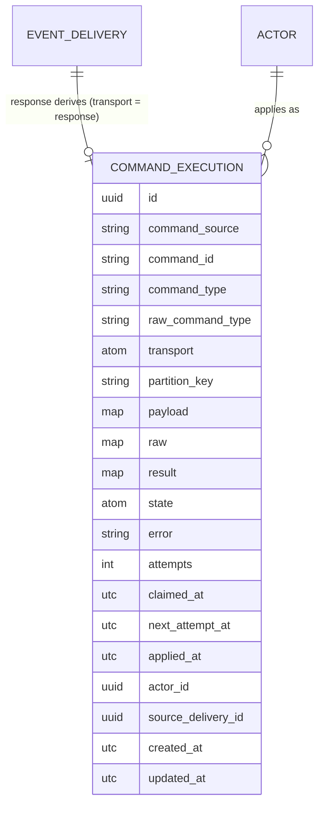

# Inbound Commands & Response-Derived Commands (Design Doc)

**Status:** Proposed · **Scope:** the library's first inbound capability — a
transport-agnostic command-execution core, the host-owned `CommandExecution`
resource, the `inbound_commands` DSL, and the feature that motivates all three:
**response-derived commands** (capturing domain-meaningful data from outbound
HTTP delivery responses and applying it back into the host's domain). Pre-1.0;
no backward-compatibility constraints.

> Internal maintainers' doc. It assumes the [outbound
> architecture](outbound-architecture.md) — the transactional outbox, the
> dispatch/delivery relays and their claim/lease/fence mechanics, the
> `(connection, event_key)` lane, the operator-trust Lua boundary — and
> [content suppression](content-suppression.md). This is the *why*; guides are
> the *how*. Much of the inbound machine specified here is **lifted from a
> production host application** that built and proved it; where this doc
> diverges from that prior art, the divergence is called out and justified.

---

## 1. Summary

The outbound model publishes facts: *"this happened"* (`product.created`). The
inbound model executes instructions: *"do this"* (`confirm_order`). The two are
deliberately asymmetric — an event has many consumers and no executor; a
command has **exactly one** executor and demands an answer (applied, failed,
duplicate). That asymmetry drives every inversion in this design.

Six load-bearing concepts:

1. **Command type** — an imperative `verb_object` token (`confirm_order`,
   `record_partner_ref`); the routing discriminator. Normalized (downcased) at
   one decode choke point; matched **exactly** after normalization.
2. **Handler** — one host module per command type implementing a deliberately
   thin behaviour (`build_input/2`, optional `partition_key/1`, `example/0`).
   The DSL declaration — not the handler, and never a script — names the
   target resource and action.
3. **`CommandExecution`** — the one host-owned resource: one row per inbound
   command, serving as idempotency record, audit trail, and (where the
   transport cannot redeliver) the dead-letter queue. There is no separate DLQ
   table; states are buckets on this row.
4. **Composite idempotency identity** — `(command_source, command_id)`, both
   required. The unique index on the pair is the dedup mechanism; everything
   else (lease, fence, retry) is recovery machinery layered on it.
5. **Transport adapter** — translates the core's four outcomes
   (`:applied` / `:failed` / `:dead_lettered` / `:duplicate`) into transport
   semantics. Three transports are designed for now: `:kafka` and `:http`
   (adapters exist in the host app, migrate later) and `:response` (built
   here).
6. **Response-derived command** — a subscription may declare a **second Lua
   script** that inspects a successful HTTP delivery's response and optionally
   emits `{command_type, payload}`, restricted to a per-subscription
   **allowlist**, executed through the command machinery with the connection's
   `owner` as the actor. The response is a one-shot artifact, so the
   `CommandExecution` row is created **in the same transaction that marks the
   delivery `delivered`** — the row is the outbox for the response fact.

The core is **transport-agnostic and DSL-independent**: it works from a plain
`command_type → handler spec` map. The DSL compiles down to that map; adapters
feed raw payloads in and translate outcomes out. Nothing in the core names a
transport, a resource, or an action — those live in the routing data and the
host's declarations.

## 2. Vocabulary

| Term | Definition |
|------|-----------|
| **Command type** | An imperative `verb_object` token (`confirm_order`). Deliberately a different shape from event types (`order.confirmed`): an event names a past fact, a command names a requested action, and the vocabulary split keeps the two catalogs from ever being confused for each other. Case-insensitive on the wire (normalized via `String.downcase/1` at the decode choke point); canonical form stored, verbatim wire string kept in `raw_command_type`; declared route keys normalized identically; then **exact** match — unknown commands still fail. |
| **Command** | One inbound instruction: `(command_source, command_id, command_type, payload)` plus transport metadata. The unit of idempotency, execution, and audit. |
| **Command source** | The namespace half of the idempotency identity — which external party/channel minted `command_id`. Required, never nullable (a nullable source would defeat the unique index: `NULL ≠ NULL` in Postgres, so two NULL-source duplicates would both insert). |
| **Command id** | The dedup token *within* a source. Alone it is unsafe — two independent sources can both say `"42"` — hence the composite identity. |
| **Handler** | One module per command type (`AshIntegration.Inbound.Declare.Handler` behaviour). Maps a validated payload to the declared action's input. Host code, trusted; the thinness is a design constraint (§10), not a trust boundary. |
| **CommandExecution** | The host-owned resource (Spark extension, schema-injected like the five outbound resources): idempotency record + audit trail + dead-letter queue in one table. |
| **Admission** | The core's first half: decode → normalize → route-check → record the row. Produces a committed `:pending` row or a fast duplicate conflict. |
| **Execution** | The core's second half: claim → build input → run the Ash action under the actor → classify → finalize. Apply + finalize commit in **one transaction fenced on the claim token**. |
| **Transport adapter** | The translation layer between a transport's semantics (Kafka offsets, HTTP request/response, an outbound delivery's response) and the core's outcomes. Adapters never contain business logic; the core never contains transport logic. |
| **Response command** | A command derived from a successful outbound delivery's HTTP response by the subscription's second Lua script, allowlisted per subscription, actor = connection `owner`. |
| **Derive script** | That second Lua script: `derive(response, event) → {command, payload} | nil`. Same operator-trust posture, runtime seam, and sandbox limits as the transform. |
| **Partition key** | An optional per-command key stored for a **future** per-key ordering gate (the reserved `:parked` chain). Stored from day one so the gate needs no migration; carries no runtime behavior yet (§9). |
| **Dead letter** | A `:dead_lettered` row: transient failures exhausted on a transport that cannot redeliver. The table is the retry source — an operator `retry` action resets it to `:pending`. |

## 3. Why command-first, and the normalization choke point

The outbound doc rejected a resource/action-first wire model because it leaks
Ash idioms. The same argument applies inbound, with sharper teeth: an inbound
wire that names resources and actions is not just ugly, it is an **attack
surface** — the sender (or, for the response transport, a partner's response
body filtered through an operator script) would be steering the host's data
model directly. So the wire speaks command types; the host's declarations —
compile-time code — resolve type → (resource, action); and Ash policies under
the supplied actor are the backstop behind that resolution, never the fence
itself (§11).

**Normalization happens exactly once.** Wire payloads arrive with whatever
casing the sender chose (`ConfirmOrder`, `CONFIRM_ORDER`). The core downcases
the type at the single decode choke point, stores the canonical form in
`command_type` and the verbatim string in `raw_command_type` (audit), and
matches the canonical form **exactly** against the routing map — whose keys
were normalized identically at registry build. Case-insensitivity is therefore
a property of the choke point, not of the match: there is one `String.downcase/1`
in the whole pipeline, no fuzzy matching, and an unknown command still fails
terminally. (Declaring `Confirm_Order` and `confirm_order` on two resources is
a *post-normalization duplicate* and a boot error — §10.)

This mirrors the outbound event-type discipline (author-chosen string, stored
verbatim, no automatic verb mapping) while inverting the tolerance: outbound
types are produced by our own code so they need no normalization; inbound
types are produced by other people's code, so they get exactly one
well-defined forgiveness (casing) and nothing else.

## 4. Data model

One new host-owned resource, `CommandExecution`, attached as a Spark extension
(`AshIntegration.Inbound.CommandExecution`) exactly like the five outbound
resources: the host names the module and table, wires it via
`config :ash_integration, command_execution_resource: …`, and the transformer
injects schema, actions, identities, and indexes (all `if_not_exists`, so
hosts can override).



### 4.1 Attributes

| Attribute | Type | Meaning |
|-----------|------|---------|
| `id` | `uuid_v7`, DB-generated | Occurrence-ordered (rows are inserted when the command arrives/is captured), so it doubles as the claim's FIFO cursor — the same property the outbound side gets from the Event id. |
| `command_source` | string, **not null** | Namespace half of the identity. For the response transport: `"response:" <> subscription_id`. Future adapters supply their own (a Kafka topic/group tag, an HTTP client identifier). |
| `command_id` | string, **not null** | Dedup token within the source. For the response transport: the `EventDelivery.id` — derived from the delivery identity so a duplicate response (timeout-then-retry where the partner processed both sends) maps to the same row and dedupes by construction. |
| `command_type` | string, not null | Canonical (downcased) type. The routing key. |
| `raw_command_type` | string, not null | The verbatim wire string, kept for audit. |
| `transport` | atom (stored as text), not null | `:kafka` \| `:http` \| `:response`. The `one_of` constraint derives from a single source-of-truth function (`Inbound.Transport.transports/0`, mirroring `Transform.Runtime.runtimes/0`), so adding a transport is a code change — a new constraint member — **never a schema migration** (the column is text; the constraint is cast-time, not a DB CHECK). |
| `partition_key` | string, nilable | Reserved ordering key (§9). Response transport: the delivery's `event_key`. Push transports: the handler's optional `partition_key/1`. No runtime behavior yet — stored so the future gate needs no migration. |
| `payload` | map (JSONB), nilable | The decoded command payload handed to the handler. Nil only for a derive-failure row (no command was produced — see `raw`). |
| `raw` | map (JSONB), nilable | **"Persist what the transport cannot give back."** For the `:response` transport this is the captured one-shot artifact (`%{status, headers, body}`, size-capped, reflected-secret-masked like the log's `response_body`); populated on derive failure so an operator can fix the script and re-derive, and *not* populated on success (the derived `payload` already carries the meaningful extract — storing every full response would balloon the table for no recovery value). For `:kafka` (offset replay) and `:http` (caller retries) it stays nil: the transport itself is the replay source. |
| `result` | map (JSONB), nilable | The handler result cached on `:applied`, returned verbatim on idempotent replay (`{:duplicate, :applied, result}` → the HTTP adapter re-serves it; the Kafka adapter just acks). JSON-safe, size-capped. |
| `state` | atom, not null, default `:pending` | `:pending` \| `:applied` \| `:failed` \| `:dead_lettered` \| `:parked` (reserved). §4.2. |
| `error` | string, nilable | The classified, scrubbed error on `:failed`/`:dead_lettered` (same whitelisting scrubber as delivery `last_error` — no decrypted credential or struct dump lands here). |
| `attempts` | integer, default 0 | Bumped **on claim** (same crash-safety argument as the delivery relay: a worker that dies mid-apply still incremented, so the ceiling bounds a crash loop). |
| `claimed_at` | utc, nilable | The soft lease **and the fence token** (§5.3) — the converged primitive (§6). |
| `next_attempt_at` | utc, nilable | Durable backoff cursor for transient retries, honored by the claim. Identical mechanism to `EventDelivery.next_attempt_at`. |
| `applied_at` | utc, nilable | Stamped once on `:applied`; a dedicated column, not an overloaded `updated_at`. |
| `actor_id` | uuid, nilable FK → `actor_resource` | The actor snapshot taken at admission (§6, actor model). Snapshotted — not resolved live at apply — so execution survives a later owner change or connection deletion, and a retry replays under the same authority the command was admitted with. |
| `source_delivery_id` | uuid, nilable FK → `EventDelivery`, `on_delete: nilify` | Provenance link for the `:response` transport (dashboard drill-down: delivery → command). Nilified rather than cascaded on delete so the two retention windows stay independent (§16). Nil for push transports. |

### 4.2 States

| State | Meaning |
|-------|---------|
| `:pending` | In the machine, not terminal. Two sub-phases distinguished by the lease: `claimed_at` set = claimed, in-flight; `claimed_at` NULL = enqueued, awaiting a claimer. |
| `:applied` | Terminal success. Caches `result` for idempotent replay. |
| `:failed` | Terminal failure — decode error, unknown command, allowlist violation, business rejection (policy/validation), failed derive. Deterministic: retrying the same input yields the same outcome, so the machinery never retries it. Caches `error`. Operator recourse exists where the input survives (`rederive` for response rows with `raw`; otherwise it is an audit record). |
| `:dead_lettered` | Transient failures exhausted (`attempts` ≥ ceiling) on a transport that cannot redeliver. **The table is the retry source**: the `retry` action clears the bookkeeping and returns the row to `:pending`. Never reaped by retention (§16) — the mirror of the outbound poison "never auto-resolved" stance. |
| `:parked` | **Reserved, not built**: the slot for a future per-key ordering gate (a command held because an older same-`partition_key` command is unresolved). Declared in the state enum now so the gate is additive. |

**Divergence from prior art, called out.** The proven host implementation
defined `:pending` as strictly *"claimed, in-flight"* because every command
arrived by push — the insert *was* the claim. The response transport breaks
that equivalence: capture must happen in the delivery's transaction (§7) while
execution must be decoupled from it (failure-domain separation, §8/§12), so
there is necessarily a committed-but-unexecuted phase. Rather than adding a
sixth state, `:pending` generalizes to "in the machine," with `claimed_at`
carrying the in-flight distinction — the same convention `EventDelivery`
already uses for `:scheduled` rows. Push-transport admission still inserts
with `claimed_at` pre-stamped (insert-as-claim, one round trip), so the prior
art's behavior is the special case, not a casualty.

### 4.3 Identities & indexes

| Index | Purpose |
|-------|---------|
| **unique** `(command_source, command_id)` | The idempotency identity. The dedup mechanism, not a backstop: admission *relies* on the conflict (a duplicate gets a fast unique-violation → the core reads the existing row and returns `{:duplicate, state, result}` — it never blocks on an in-flight apply, because the claim row committed in its own transaction). |
| `(id) WHERE state = 'pending'` | The relay's claim scan (FIFO by occurrence-ordered id), partial on the small live frontier. |
| `(partition_key, id) WHERE state IN ('pending','parked')` | Reserved for the future ordering gate (mirrors the outbound schedulable-lane index). Cheap to carry now; saves a backfill-under-load later. |
| `(state, updated_at)` | Retention's reap scan. |
| `(source_delivery_id)` | The delivery → command drill-down. |
| `(command_type, state)` | Dashboard/operator filtering ("all dead-lettered `record_partner_ref`"). |

## 5. The processing model

The core (`AshIntegration.Inbound.Execute`) is two composable halves. The
single push-transport entrypoint composes them inline:

```
handle(raw, meta) →
    {:applied, result}
  | {:failed, reason}
  | {:dead_lettered, reason}
  | {:duplicate, state, cached_result_or_error}
```

`raw` is the undecoded payload (binary or already-decoded map); `meta` carries
the transport facts (`transport`, `command_source`, `actor_id`,
`partition_key` hints). No transport types, no host-domain types — the core's
only collaborators are the routing map (§10) and the `CommandExecution`
resource.

### 5.1 Admission (decode → normalize → route → record)

1. **Decode.** Binary → JSON; extract `command`, `command_id`, `payload` from
   the envelope. A malformed payload is a **terminal** failure: the row is
   recorded `:failed` with the decode error *when identity is recoverable*
   (we have a `command_id`); when even the identity is unreadable there is
   nothing to dedup against, and the outcome is `{:failed, reason}` with no
   row — the adapter's transport semantics (HTTP 400, Kafka ack-and-count)
   carry the signal. This is the one place a command can fail without a row,
   and it is unavoidable: an idempotency record without an identity is a
   contradiction.
2. **Normalize.** Downcase the type; keep the verbatim string. The single
   choke point (§3).
3. **Route-check.** Exact-match the canonical type against the routing map.
   Unknown → record `:failed` ("unknown command") — terminal, because
   redelivery won't teach the host a new command type. (Recording it — rather
   than dropping — is deliberate: the row is the operator's evidence that a
   partner is sending something we don't speak.)
4. **Record.** Insert the `:pending` row — **committed in its own
   transaction**, never inside the apply. Push transports insert with
   `claimed_at = now()` (insert-as-claim); the response transport inserts
   unclaimed (its transaction budget belongs to the delivery, §7). A unique
   conflict short-circuits to `{:duplicate, state, cached}`: duplicates get a
   fast answer and **never block on a concurrent apply** — the whole point of
   committing the claim separately.

### 5.2 Execution (claim → build → apply → classify → finalize)

For push transports, execution continues inline in the adapter's process
(the caller is waiting). For the response transport — and for **recovery of
any stale `:pending` row regardless of transport** — execution is driven by
the **command relay** (§5.4).

1. **Claim.** Atomically stamp `claimed_at = now()` and bump `attempts`
   (single UPDATE, `FOR UPDATE SKIP LOCKED` in the relay's batch form), gated
   on: `state = 'pending'`, `attempts < max_attempts`, backoff elapsed
   (`next_attempt_at` null/past), lease free (`claimed_at` null or older than
   the lease window). The claimer captures the stamped `claimed_at` value —
   the **fence token**.
2. **Build.** Look up the handler spec; call `build_input(payload, ctx)`.
   `ctx` carries the actor, the command row (id, source, type, occurrence
   id), and — for response commands — the source delivery's identifiers. A
   raising/erroring `build_input` is terminal (deterministic on the same
   payload).
3. **Apply + finalize, one fenced transaction.** Open a transaction; run the
   declared Ash action with `actor: actor, authorize?: true`; then apply the
   finalizing state transition (`:apply_success` / `:apply_failure`) **with a
   filter on `claimed_at == <the token from step 1>`** (plus the
   `state == :pending` guard baked into the action). If the filter matches
   zero rows — a superseded claimer: its lease expired and another pass
   re-claimed — the core **raises inside the transaction**, rolling back the
   handler's entire effect. This is the load-bearing property lifted from the
   prior art: *a slow worker that lost its claim leaves no trace*, not a
   half-applied command finalized by someone else. Exactly one claimer's
   apply-plus-finalize ever commits.
4. **Classify.** Errors sort into **terminal** (deterministic — will fail
   identically on retry: `Ash.Error.Invalid`, `Ash.Error.Forbidden`, a
   raising handler) → `:failed`; and **transient** (infrastructure:
   DB/connection errors, timeouts) → a bounded inline retry (small internal
   constant), then transport-appropriate capture: stamp `next_attempt_at`
   backoff and leave `:pending` (the relay retries), or — at the attempt
   ceiling — `:dead_lettered`. Classification is core policy, not handler
   code: the boundary between the two classes is exactly the boundary between
   "retrying is wasted work" and "retrying is the fix", and getting it wrong
   in either direction is the expensive failure mode (terminal-as-transient
   burns the retry budget on a no-hope row; transient-as-terminal silently
   drops recoverable work).

### 5.3 Claim + lease + fence — the converged mechanics

Identical in shape to the delivery relay's (§9 of the outbound doc), and
deliberately so (§6 picks the primitive):

- **Committed claim.** The row (or the claim stamp on it) commits before the
  apply begins, in its own transaction. Duplicates conflict fast.
- **Soft lease.** A `:pending` row whose `claimed_at` is older than the lease
  window is re-claimable. The lease is a **recovery-latency knob, never a
  correctness mechanism** — a too-short lease wastes work (a superseded
  claimer's transaction rolls back harmlessly); a too-long one delays crash
  recovery. Fixed internal constant (60s, matching dispatch): command apply
  is DB-bound with no transport timeout to derive from, and the fence makes
  the consequence of a mis-sized lease wasted work, not corruption.
- **Fence token.** The `claimed_at` value captured at claim. Every finalizing
  write filters on it; apply + finalize share one transaction; a stale
  claimer's unmatched filter aborts and rolls back the apply too.

### 5.4 The command relay

A small poll-claim loop (`AshIntegration.Inbound.Execute.Relay`, Broadway like
its two outbound siblings — same producer/claim/ack shape, one pipeline per
node, `SKIP LOCKED`, no leader election, **no job queue**: the
`CommandExecution` table is the durable record and the relay claims it
directly). Discovery is **poll-only** — the same honest-latency argument as
dispatch §6: idle response-command latency ≈ `poll_interval_ms`, uniform
across nodes; no in-process nudge.

The relay claims **any** stale-or-unclaimed `:pending` row, not just
`:response` rows. For push transports this makes it the universal crash-
recovery sweep: a Kafka consumer that died mid-apply left a leased `:pending`
row; whichever arrives first — the broker's redelivery (whose admission hits
the duplicate conflict and takes over the expired lease) or the relay's sweep
— executes it, and the fence arbitrates if both run. The relay can do this
*because the actor is snapshotted on the row* (§6): it needs nothing from the
transport to execute correctly.

### 5.5 Outcome → transport behavior

The core's outcomes are transport-free; each adapter owns the translation.
The `:kafka` and `:http` rows below are **design obligations on the core**
(the outcomes must be sufficient to drive them), not implementation scope —
those adapters live in the host app and migrate later.

| Outcome | `:kafka` (Broadway consumer) | `:http` (Phoenix endpoint) | `:response` (this doc) |
|---------|------------------------------|---------------------------|------------------------|
| `{:applied, result}` | ack the offset | 200 + result body | telemetry; row is the record |
| `{:failed, reason}` | ack (terminal — redelivery can't fix it); the row is the evidence | 422 + error body | telemetry; row is the evidence |
| `{:dead_lettered, reason}` | *(not produced — transients raise/nack so the broker redelivers; the offset is the retry source)* | *(not produced inline — see below)* | loud telemetry + log; `retry` action is the recourse |
| transient, budget left | nack/raise → broker redelivers | 503 + Retry-After; row stays `:pending`, the caller's retry re-claims after the lease | row stays `:pending` with `next_attempt_at`; the relay retries |
| `{:duplicate, :applied, result}` | ack | 200 + cached result (idempotent replay) | impossible-by-construction conflict absorbed at capture (§7.2) |
| `{:duplicate, :failed, error}` | ack | 422 + cached error | absorbed at capture |
| `{:duplicate, :pending, _}` | in-flight elsewhere: nack with delay (or pause) — the eventual outcome will ack the redelivery | 409/425 retry-later | absorbed at capture |

**Persistence asymmetry, derived from one principle — persist what the
transport cannot give back:**

| Transport | Can re-obtain the command? | What persists |
|-----------|---------------------------|---------------|
| `:kafka` | Yes — offset replay | Idempotency rows + terminal failures. Transients lean on redelivery; `:dead_lettered` is not produced. |
| `:http` | Yes — the caller retries | Idempotency rows + cached `result`/`error` for replay. Transients answer 503 and lean on the caller. |
| `:response` | **Never** — one-shot artifact | **Everything, upfront, transactionally** — the row (with payload, or `raw` on derive failure) is created in the delivery's success transaction; transients exhaust into `:dead_lettered` because nothing upstream will ever re-present the response. |

## 6. Two convergence decisions

**Fencing: `claimed_at` lease token, not an optimistic-lock version.** The
proven inbound implementation fenced on a version counter; the outbound
delivery relay fences on the `claimed_at` timestamp it stamps at claim. Both
are sound here, because a fence only ever has to distinguish *successive
claims of the same row*, and successive claims are separated by at least the
lease window (seconds) — so timestamp collision is impossible by
construction, and the version counter's one theoretical advantage (collision
robustness at arbitrary frequency) buys nothing. Everything else favors the
timestamp: it is **one column doing two jobs** (lease *and* token, vs. lease
*plus* counter), it is the primitive the delivery relay already uses (one
mental model, one set of test patterns, shared `Ash.Changeset.filter(expr(claimed_at == ^token))`
ergonomics), and converging means the lifted host code changes its fence
mechanically rather than the library carrying two primitives forever.
**Decision: the library standardizes on the committed-claim + soft-lease +
`claimed_at`-fence triple for both directions.** The lifting cost lands on
the host migration (drop the version column, fence on the lease stamp) and is
mechanical.

**Actor: snapshotted at admission, per-transport at the seam.** Every
execution runs `authorize?: true` under an actor; the question is who
supplies it.

| Transport | Actor | How it reaches the row |
|-----------|-------|------------------------|
| `:response` | the connection's `owner` | stamped `actor_id = connection.owner_id` at capture (the connection is loaded in the relay already) |
| `:kafka` (future) | host-configured per consumer/topic | the adapter passes `actor_id` in `meta`; admission stamps it |
| `:http` (future) | the authenticated caller, or a host-configured service actor | same seam — the adapter resolves authentication to an `actor_id` before calling `handle/2` |

The seam is the `meta.actor_id` → `actor_id` column: adapters resolve
identity (that's transport work); the core stores and replays it (that's
execution work). Snapshotting — rather than re-resolving owner-via-connection
at apply — is what lets the relay retry any row days later under the same
authority, survive connection deletion, and keep `:response` rows executable
when the delivery chain has been reaped. The trade-off is honest: a
*revoked* owner keeps authority over already-admitted commands until they
drain. We accept that (admission time is when the instruction was accepted;
the same logic that lets an HTTP response commit under the session that
started the request), and note that Ash policies evaluate the actor *record*
live at apply — a deactivated owner whose policies check `active` still
fails closed.

## 7. Response-derived commands, end to end

The motivating feature. Outbound HTTP deliveries get responses we currently
throw away after logging a truncated, redacted copy. Some responses carry
domain data — the canonical example: the partner's own reference id for the
record we just announced, which the host wants to store on its side.

### 7.1 Declaration surface

Two new attributes on the **Subscription** (via its transformer, like
`suppress_unchanged`):

- `response_command_source :: string, nilable, max_length 10_240` — the
  derive script. Nil = feature off (the default; nothing changes for existing
  subscriptions). Interpreted by the subscription's existing
  `transform_runtime` tag — the derive script is a second program in the same
  language, through the same `Transform.Runtime` seam, under the same
  `Limits`.
- `response_command_types :: {:array, :string}, default []` — the
  **allowlist**: the only command types the script may emit. Normalized at
  save (the same downcase), validated at save against the command catalog
  (unknown type → save error) and re-checked at boot (a type that has since
  left the catalog → loud warning, mirroring `warn_orphaned_subscriptions` —
  a data problem must not crash boot).

Save-time validations: a non-nil script requires a non-empty allowlist; the
subscription's connection must be `:http` (a Kafka produce has no response
*body* — the broker ack carries offset/partition, which is bookkeeping, not
domain data; if a future transport grows meaningful acks, it adds a variant,
not a redesign).

### 7.2 The script contract

```lua
-- response: read-only; body JSON-decoded when the content-type is JSON,
--           else the raw string (size-capped); headers downcased.
-- event:    the same read-only envelope the transform saw.
function derive(response, event)
  if response.status == 201 and response.body.partner_ref then
    return {
      command = "record_partner_ref",
      payload = { product_id = event.data.id, ref = response.body.partner_ref }
    }
  end
  return nil   -- no command; the overwhelmingly common case
end
```

The script returns `{command, payload}` or `nil`. **It cannot name a
resource, an action, or an actor** — only a command type, and only one on its
subscription's allowlist. Host code (the routing map built from compile-time
declarations) resolves type → action; Ash policies under the owner actor are
the backstop behind that, not the fence in front of it. The same
sandbox limits bound it (`max_reductions` / `:max_heap_size` / `max_time`,
`Task.Supervisor.async_nolink` isolation); unlike the transform it has **no
egress surface at all** — its output is a row insert, never a URL or header,
so the SSRF/header-injection guards don't apply and nothing replaces them.
Output *is* validated at the boundary (host code, post-Lua): the type
normalizes and exact-matches the allowlist; the payload must be a JSON-safe
map under a size cap; anything else is a derive failure (§7.4).

### 7.3 The success path — exact transaction boundaries

The capture lives in the **delivery relay's** success path, because that is
the only place the live, untruncated, unredacted response exists. (The
delivery log's `response_body` copy is truncated and secret-redacted **by
design** — it is an audit artifact, not a data source; deriving from it would
silently corrupt payloads that exceed the truncation cap. This is why capture
cannot be deferred to any post-hoc reader of the log.)

Today's path (relay.ex): transport returns `{:ok, metadata}` →
`finalize(delivery, :deliver, %{delivery_metadata: metadata})`, where
`:deliver` is guarded on `state == :scheduled`, fenced on the `claimed_at`
filter at the call site, and runs `OnDeliverySuccess` (log write + counter
resets) as an after-action hook **inside the update's transaction**. The
feature extends this in two steps:

**T1 — derive, outside any transaction.** After the transport returns and
before `finalize`, if the subscription declares a script: run `derive` in the
sandbox over the live response; normalize + allowlist-check the returned
type; precompute the full row params (`command_source`, `command_id =
delivery.id`, canonical + raw type, `payload`, `transport: :response`,
`partition_key: delivery.event_key`, `actor_id: connection.owner_id`,
`source_delivery_id: delivery.id`). The Lua run happens **before the
transaction opens** — a sandboxed script with a wall-clock budget must not
hold a DB transaction (and its connection) hostage.

**T2 — capture + finalize, one transaction.** Call `finalize(delivery,
:deliver, %{delivery_metadata: …, response_command: precomputed_or_nil})`.
Inside the `:deliver` action's transaction, alongside `OnDeliverySuccess`, a
new `OnResponseCommand` after-action hook inserts the `CommandExecution` row
(state `:pending`, unclaimed) — **upsert with on-conflict-do-nothing on the
`(command_source, command_id)` identity**.

The boundary placement is the invariant: *the row commits iff `delivered`
commits.*

- **Relay crashes between send and finalize** → nothing committed → the lease
  expires → re-claim → re-send (at-least-once, as today). The partner may
  process twice; both responses funnel to the same delivery row, the fenced
  `:deliver` applies exactly once, so exactly one capture happens — and had
  the duplicate raced in through any other path, the identity conflict
  absorbs it. This is precisely why `command_id` derives from the delivery
  identity and not from anything response-side.
- **Command insert fails (DB error mid-transaction)** → the whole `:deliver`
  rolls back → the delivery stays `:scheduled` → lease re-claims → re-send.
  Trade-off, stated plainly: we buy "the response fact is never silently
  lost" at the price of "a DB hiccup on the capture costs a duplicate
  outbound send." At-least-once delivery already grants that send; losing a
  one-shot response is unrecoverable. Atomicity wins.
- **Stale claimer** → the fence makes its whole `:deliver` (capture included)
  a no-op/rollback. No orphan command rows from lost races.

**T3 — execution, decoupled.** Post-commit, telemetry fires and the command
relay discovers the row on its next poll and executes it (§5.2) under the
owner actor. Nothing about T3 can reach back into the delivery: by the time
the command exists, the delivery is terminally `delivered`.

Suppressed and cancelled deliveries send no bytes, get no response, and
derive nothing — the feature rides only real sends, by construction.

### 7.4 When derive fails

The delivery **succeeded** — a failing script must not undo that (§8). A
derive failure (Lua error/timeout, type not on the allowlist, malformed
return) is recorded as a `CommandExecution` row in the same T2 transaction,
state `:failed`, with the error and — uniquely — `raw` populated with the
captured response (`%{status, headers, body}`, size-capped, reflected-secret-
masked with the same masking the log applies). A `rederive` action re-runs
the (since-corrected) script over the stored `raw` and, on success, fills
`command_type`/`payload` and resets the row to `:pending` — the inbound
mirror of `reprocess`-from-the-immutable-`Event`. The masking caveat is
documented honestly: a re-derive sees the masked body, so a partner that
echoes our own secret back *as the domain datum* can't be recovered this way
— acceptable, because that partner is broken in a more important way.

A response too large even for capped `raw` capture is truncated with a
marker; the failure row still exists, the operator still sees *that* a
response carried something, even if not all of *what*.

## 8. Strict failure-domain separation

The principle, stated once and enforced everywhere: **the delivery's job
ended when the partner acknowledged the bytes.** Everything downstream of
that acknowledgment fails on its own surface.

A failing response-command — derive failure, terminal business rejection,
transient exhaustion — must never:

- park the delivery, or move it out of `delivered`;
- bump `consecutive_failures` on the subscription or connection;
- suspend anything;
- block the `(connection, event_key)` lane.

The transport proved healthy and the subscription's content was accepted;
counting a host-side apply failure against either would be a category error —
the same reasoning that keeps a `parked` transform failure (outbound §10) out
of the suspension counters, applied one stage further downstream. The
response-command surface has its own states (`:failed`, `:dead_lettered`),
its own retry affordances (`next_attempt_at`, `retry`, `rederive`), its own
telemetry, and its own dashboard health signal (a standing dead-letter count,
§15). The one deliberate coupling is forward-only: the command row is created
*by* the delivery transaction. Nothing flows back.

## 9. Ordering — where the delivery lane ends

The outbound lane gives a precise inherited guarantee, and it is worth
stating exactly where it stops:

- **Capture is strictly ordered per `(connection, event_key)`.** The lane
  holds at most one in-flight delivery, and the scheduler promotes the next
  head only after the previous is terminal — and "terminal" means *its
  `:deliver` transaction committed, command row included*. So response rows
  for a key are **created** in delivery order, with occurrence-ordered
  UUIDv7 ids reflecting it.
- **Execution is FIFO-by-claim, not serialized per key.** The relay claims
  oldest-id-first, so the common case applies in order. But nothing prevents
  two same-key commands claimed in one batch from applying on different
  workers concurrently, and a transient failure on command N (backing off)
  lets command N+1 overtake it. **Default: parallel apply, no per-key gate.**

That default is a conscious decision, and it is the **opposite** call from
the outbound poison policy — so the justification needs to be explicit. The
outbound side chose correctness-over-liveness (a stuck head blocks its lane
forever) because the downstream party is an *external consumer* who cannot be
made to enforce invariants and for whom a reorder is silent corruption. The
inbound executor is the **host's own Ash action**, which has every tool to
defend itself: validations, optimistic locks, "only move forward" state
guards, and the occurrence id in `ctx` for an explicit LWW guard. A reorder
the host cares about surfaces as a visible `:failed` row, not silent
corruption on someone else's system — and a gate-by-default would let one
dead-lettered command silently freeze every later command on its key, the
very head-of-line cost the outbound side accepts only because it must.

What `partition_key` on the row buys **today**: the stored key + the reserved
`(partition_key, id) WHERE state IN ('pending','parked')` index + the
reserved `:parked` state mean the future **ordering gate** — promote at most
one `:pending` per key, hold successors `:parked`, scheduler-style — is a
pure code addition, **no migration**. What is explicitly deferred with it:
the parking-chain semantics (does a `:dead_lettered` head release or hold its
key?), per-key claim batching, and whether the gate is opt-in per command
type or per subscription. Hosts that need strict per-key serialization before
the gate exists keep their handlers commutative/idempotent or guard on the
occurrence id — and the guides say so in those words.

## 10. The `inbound_commands` DSL, registry, and Handler behaviour

A resource-level Spark DSL (`AshIntegration.Inbound.Declare.Commands`)
mirroring `outbound_events` in shape and inverting it in semantics:

```elixir
defmodule MyApp.Catalog.Product do
  use Ash.Resource,
    extensions: [AshIntegration.Outbound.Declare.Source,
                 AshIntegration.Inbound.Declare.Commands]

  inbound_commands do
    command "record_partner_ref" do
      action :record_partner_ref          # must exist on THIS resource (verifier)
      handler MyApp.Inbound.RecordPartnerRef
    end
  end
end
```

### 10.1 Uniqueness, not union — the deliberate inversion

An event type is the *union* of every declaration naming it (many sources,
one fact). A command type has **exactly one executor** — two resources both
claiming `record_partner_ref` is not a richer declaration, it is ambiguous
routing, and ambiguous routing of an *instruction* is a correctness bug. So
the registry's `verify!/0` raises at boot on any **post-normalization
duplicate** across all scanned resources (`Confirm_Order` here and
`confirm_order` there collide — the catalog's keys are canonical). Same
mechanism as the outbound producer-consistency check: a code bug that
surfaces in dev/CI, so it fails the boot loudly.

The module-local Spark verifier checks per-declaration validity at compile
time: the named `action` exists on the resource, the `handler` is a module.
The boot-time `verify!/0` adds the cross-module checks: global uniqueness,
handler callbacks exported (`build_input/2`, `example/0`; `partition_key/1`
optional), and the echo-loop scan (§11.2). `warm/0` builds the snapshot into
`:persistent_term` exactly like the outbound registry — the DSL is
compile-time, so the catalog is immutable for the running system and every
hot-path read is O(1).

### 10.2 The registry value is a struct, and the core never sees the DSL

```elixir
%AshIntegration.Inbound.Declare.Registration{
  command_type: "record_partner_ref",   # canonical
  resource: MyApp.Catalog.Product,
  action: :record_partner_ref,
  handler: MyApp.Inbound.RecordPartnerRef
}
```

A struct, not a tuple — adding a field later (a `version`, a queue tag, a
per-type concurrency cap) is additive instead of a positional break
everywhere a tuple was matched. There is **no version entity yet**: commands
have a single consumer (the host itself), so versioning has no subscriber to
serve — speculating one now would be pure carrying cost. The struct is the
extension point if that changes.

The core's routing input is `%{canonical_type => %Registration{}}` — **a
plain map**. The DSL + registry are one producer of that map; tests hand the
core a literal; a future host that wants no DSL at all passes its own. The
dependency arrow points one way (DSL → data → core), never back.

### 10.3 The Handler behaviour — and why exactly these callbacks

```elixir
defmodule MyApp.Inbound.RecordPartnerRef do
  use AshIntegration.Inbound.Declare.Handler

  @impl true
  def build_input(payload, ctx) do
    {:ok,
     MyApp.Catalog.Product
     |> Ash.Changeset.for_update(:record_partner_ref,
          %{ref: payload["ref"]},
          actor: ctx.actor)}   # record lookup elided; host logic
  end

  @impl true
  def example, do: %{"product_id" => "…", "ref" => "PARTNER-123"}
end
```

- **`build_input/2`** — payload + ctx → a prepared changeset/action-input for
  the **declared** (resource, action). The core asserts the built
  changeset's resource/action match the declaration (a cheap guard against
  declaration/handler drift) and executes it under the actor with
  `authorize?: true`. Returning a changeset rather than a bare input map is
  the honest scope: payload → record resolution ("find the order by the
  partner's reference") is irreducibly host logic, and inventing a lookup
  mini-DSL to keep handlers map-shaped would relocate that logic into
  configuration without removing it.
- **`partition_key/1`** *(optional)* — payload → the ordering key stored on
  the row (§9). Optional because most commands don't care; absent = nil key =
  never gated.
- **`example/0`** — a sample wire payload. Powers the dashboard preview
  (run a command type's example through `build_input` to show the operator
  what it would do — dry-run, never executed) and the **golden-payload
  contract test** (§17): `build_input(example(), ctx)` must succeed for every
  registered handler, turning "the handler and its documented payload drifted
  apart" into a CI failure. The exact mirror of the Producer's `example/1`.

Deliberately **absent**, with reasons: no `produce`-style capture (commands
arrive, they aren't observed); no `project` (no fan-out — one executor); no
success/failure hooks (side effects belong in the Ash action's own changes,
where they're transactional with the apply); no `classify_error/1` (terminal
vs. transient is core policy — §5.2 — and a per-handler override would let
one handler quietly turn a deterministic failure into an infinite retry; if a
real need emerges it goes on the Registration struct as reviewed data, not on
the handler as code). Three callbacks is the whole surface; the Producer's
four-callback weight existed to serve capture and fan-out, and commands have
neither.

### 10.4 The reserved door: non-resource commands

Some future commands won't target one resource's action — a domain-level
generic action, a Reactor orchestration. **The reservation is explicit and
structural:** the `Registration` struct's `{resource, action}` pair is
conceptually a *target*, and a future variant (`target: {:generic_action,
domain, name}` or `target: {:reactor, module}`) is an additive field change
behind the same `build_input/2` contract. The DSL would grow a sibling
declaration site (domain-level, since there is no resource to hang it on).
Nothing is built now — the door is noted so nobody welds it shut by
hard-coding `resource.action` assumptions into the core's execute step; the
execute step dispatches on the target shape from day one even though one
shape exists.

## 11. Trust model

Concentric rings, from least to most trusted:

1. **The wire / the partner's response** — untrusted data. Decoded
   defensively, size-capped, normalized once.
2. **The derive script** — operator-authored, untrusted at runtime (the
   transform's posture exactly): sandboxed (reductions/heap/wall-clock,
   `async_nolink`), output schema-validated at the boundary, and **capability-
   restricted to the allowlist** — the script chooses *among* pre-approved
   command types; it can never mint authority. No egress surface exists on
   this path (§7.2).
3. **The allowlist** — operator-declared data, validated against the
   compile-time catalog at save and boot.
4. **The declarations + handlers** — host code, trusted, boot-verified.
5. **Ash policies under the actor** — the final backstop. Every apply runs
   `authorize?: true` with the per-transport actor (§6). The fence is the
   allowlist + declarations; policies are defense in depth behind them — if
   an owner shouldn't be able to `record_partner_ref` on this product, the
   policy says no and the command fails terminally, *visibly*, as a
   `:failed` row.

### 11.2 The echo loop — a first-class hazard with a name

A response-command that mutates a resource whose actions feed the **same
subscription's event type** closes a cycle: deliver → respond → command →
mutate → capture → dispatch → deliver → … Each iteration is a *new* event and
a *new* delivery, so identity dedup never terminates it; content suppression
*can* bound it (a converged mutation stops producing distinct bodies) but
only if the mutated fields fall outside the projection or stop changing —
an incidental, fragile damper, not a guarantee.

**The Open-Loop Invariant:** *no subscription may be downstream of its own
response commands* — formally, for a subscription with event type `E` and
allowlist `Ts`: no `T ∈ Ts` may resolve (via the command registry) to a
`(resource, action)` that (via the outbound registry) produces `E`.

Both registries are derived, boot-time data, so the check is a static join.
Enforcement options evaluated:

| Option | Verdict |
|--------|---------|
| **Boot-time + save-time verifier warning** | **Recommended.** The static signal is precise about the *structure* (this command type does target an action that produces your event type) but blind to the two legitimate escapes: `project/3` may skip this subscription for the mutated records, and a narrow projection + `suppress_unchanged` makes the loop converge in one extra round trip — a pattern the guides will document as *the* sanctioned read-back design. A hard error would forbid exactly the converging designs the feature exists for. So: loud `Logger` warning at boot, surfaced as a standing badge on the subscription's dashboard page, and flagged in the save-time form UI. |
| Boot-time hard error | Rejected for the false positives above; revisit as an opt-in strictness flag if real hosts get burned. |
| Runtime hop budget (provenance) | The only *sound* fence — tag the apply's changeset context with the command id, have capture copy it to the Event, refuse/alarm at depth N. Genuinely workable, but it threads provenance through host actions and breaks silently when a handler's action internally invokes others without context propagation. **Deferred**, recorded as the upgrade path if a production loop ever slips past the static check. |
| Documentation only | Rejected — the failure mode is an unbounded, partner-visible, money-costing loop; "we wrote it down" is not a control. |
| Runtime rate circuit-breaker (per-lane command frequency alarm) | Worth having *eventually* as generic protection (it also catches loops through *other* subscriptions — A feeds B feeds A — which the per-subscription static check cannot see). Deferred; noted in open questions. |

The cross-subscription loop blindness is stated honestly: the invariant and
its check are per-subscription; multi-hop cycles through two connections are
out of the static check's reach today.

## 12. Failure handling & blast radius

| Failure | Where | Result | What it does **not** touch |
|---------|-------|--------|---------------------------|
| Undecodable payload, identity recoverable | admission | `:failed` row (terminal) | nothing else |
| Undecodable payload, no identity | admission | `{:failed, reason}`, **no row**; transport signal (400 / ack-and-count) | the table |
| Unknown command type | admission | `:failed` row — the operator's evidence | routing of other types |
| Duplicate arrival | admission | fast conflict → `{:duplicate, state, cached}` | the in-flight/terminal original |
| Handler `build_input` raises/errors | execution | `:failed` (terminal, deterministic) | other command types; the transport |
| Business rejection (policy / validation) | execution | `:failed`, error cached | retry budget (never retried) |
| Transient infra (DB down, timeout) | execution | bounded inline retry → `:pending` + backoff → relay retries → at ceiling `:dead_lettered` | terminal rows |
| Worker crash mid-apply | execution | txn rolls back; lease expires; re-claim (relay or redelivery); fence arbitrates | committed state — no half-applies |
| Stale claimer finalizes late | execution | fence filter matches nothing → its whole txn rolls back | the winning claimer's result |
| Derive script fails / disallowed type / bad shape | response capture (T1→T2) | `:failed` row **with `raw`** → `rederive` recourse | **the delivery** (stays `delivered`), counters, suspension, the lane |
| Command insert fails in T2 | response capture | whole `:deliver` rolls back → re-send → re-capture | — costs one duplicate send (at-least-once already grants it) |
| Response-command later fails/dead-letters | execution | its own row, its own telemetry | **everything outbound** (§8) |
| Allowlist references a vanished command type | boot | loud warning (data drift, never a boot crash) | boot |
| Duplicate command declaration | boot | **raise** (code bug) | — |
| Open-Loop Invariant violated | boot/save | warning + dashboard badge (§11.2) | the save (allowed, flagged) |

## 13. Guarantees

| Guarantee | Scope |
|-----------|-------|
| Execution | Exactly-once *effect* per `(command_source, command_id)`: at-least-once attempts, but the identity conflict + fenced single-transaction apply-and-finalize mean exactly one apply ever commits. |
| Idempotent replay | A duplicate of an `:applied`/`:failed` command returns the cached `result`/`error` without re-executing. Horizon = the retention window (§16). |
| Response capture | A response-command row exists **iff** its delivery is `delivered` (same transaction). A one-shot response is never lost after `delivered` commits. |
| Response dedup | `command_id = delivery.id` → all retries/duplicates of one delivery collapse to one command. |
| Failure isolation | No response-command outcome mutates delivery state, failure counters, suspension, or lane availability. |
| Ordering | Response-command **creation** is in delivery-lane order per `(connection, event_key)`; **execution** is FIFO-by-claim with no per-key serialization (the documented default; gate deferred — §9). |
| Authorization | Every apply runs `authorize?: true` under the per-transport actor; the allowlist + compile-time declarations fence what a script can even request. |
| Dead letters | Never auto-resolved, never reaped; the `retry` action is the recourse — the inbound mirror of the outbound poison stance. |

## 14. Telemetry

Following the `[:ash_integration, <area>, <event>]` convention; all are added
to `AshIntegration.Telemetry.events/0`:

| Event | Measurements | Metadata |
|-------|--------------|----------|
| `[:ash_integration, :command, :applied]` | `count`, `attempts`, `duration_ms` (admission → applied) | `command_type`, `command_source`, `transport`, `command_execution_id` |
| `[:ash_integration, :command, :failed]` | `count`, `attempts` | + `error_kind` (`:decode`/`:unknown`/`:build`/`:rejected`) |
| `[:ash_integration, :command, :dead_lettered]` | `count`, `attempts` | same — the loud one; mirrors `:delivery, :poison` |
| `[:ash_integration, :command, :duplicate]` | `count` | + `original_state` |
| `[:ash_integration, :response_command, :emitted]` | `count` | `subscription_id`, `connection_id`, `command_type`, `event_type`, `event_key` |
| `[:ash_integration, :response_command, :derive_failed]` | `count` | same minus `command_type`, + `error_kind` (`:script`/`:disallowed`/`:invalid_output`) |

No per-claim or per-`nil`-derive event — both fire constantly and carry no
operator decision. The standing/queryable signals (dead-letter counts,
oldest-pending age) are dashboard aggregates, not telemetry, per the
parked-health precedent.

## 15. Dashboard

An **Inbound** section beside the existing outbound pages
(`web/live/inbound/`, same router macro):

- `/commands` + `/commands/:id` — the `CommandExecution` index (filter by
  state/type/source/transport) and detail: payload, result or error, attempt
  history, the `source_delivery_id` link back to the delivery (and the
  delivery's show page gains the inverse link), and the `retry` / `rederive`
  operator actions.
- `/command-types` + `/command-types/:type` — the derived catalog (the
  registry view, mirroring `/event-types`): declaration site, target
  resource/action, handler, the `example/0` payload, a dry-run preview
  (`build_input` over the example, never executed), and which subscriptions
  allowlist the type.
- Dashboard home gains inbound stats: pending depth, dead-letter count
  (the standing health signal — §8), applied-last-24h.
- The subscription form/show gains the response-command panel: script editor
  with the same preview affordance as the transform (run `derive` over a
  sample response — see open questions for where the sample comes from),
  allowlist editor validated against the catalog, and the Open-Loop warning
  badge when the static check flags it.

## 16. Configuration & retention

Host wiring (mirrors the resource-wiring block):

```elixir
config :ash_integration,
  command_execution_resource: MyApp.Inbound.CommandExecution,
  command_domains: [MyApp.Catalog]   # scanned for `inbound_commands`
```

The command stage owns and validates its slice at boot via NimbleOptions
(`AshIntegration.Inbound.Execute.Supervisor`), intent-named, following the
dispatch/delivery precedent:

```elixir
config :ash_integration,
  command: [
    concurrency:      System.schedulers_online(),  # DB-bound, like dispatch — not I/O-bound like delivery
    poll_interval_ms: 250,                          # relay poll cadence ≈ idle response-command latency
    batch_size:       100,                          # rows claimed per round
    max_attempts:     10,                           # claims before dead-letter (counts claims, crash-safe)
    backoff_base_ms:   1_000,
    backoff_max_ms:  300_000
  ]
```

Deliberately **internal**, not knobs: the claim lease (fixed 60s — apply is
DB-bound with no transport timeout to derive it from, and the fence makes a
mis-sized lease cost wasted work, not correctness); the inline transient
retry count; the `payload`/`result`/`raw` size caps; the Broadway wiring.
The single `enabled?` gates the relay with the rest of the runtime; no
per-stage flag. The derive script reuses the existing `lua_sandbox` limits —
no second limit vocabulary.

**Retention.** The `:retention` slice grows `command_days` (default 90,
alongside `delivery_days`/`event_days`); the sweeper reaps `:applied` and
`:failed` rows older than the window. `:dead_lettered` is **never reaped**
(it is unexecuted work with an operator recourse — reaping it would silently
drop a command, the inbound twin of "auto-reaping poison events"); `:pending`
is never reaped (it either applies or dead-letters). The constraint, stated
as the invariant it is: **the reap window is the idempotency horizon.** A
duplicate arriving after its original is reaped finds no row and re-applies.
That is safe exactly when the transport's redelivery horizon is shorter than
the window — true by orders of magnitude for HTTP client retries and Kafka
redelivery, and true *by construction* for `:response` (a delivery reaped
after `delivery_days = 90` can never produce a new response). A host
replaying months-old Kafka offsets from zero must raise `command_days` first;
the guides say so.

**Connection reuse — an honest note.** The outbound doc (§12, §14) says
inbound "would reuse the same Connection." For the transports actually
designed here, that claim mostly doesn't cash out: the `:response` transport
needs **no new connection concept at all** (it rides the existing outbound
delivery — the connection is already in hand in the relay), and a future
inbound-from-partner HTTP/Kafka adapter shares with `Connection` only partner
identity and credentials — none of the ordering domain, suspension machinery,
or transport-host semantics that make `Connection` what it is. Whether
inbound-from-partner transports reuse `Connection`, extend it, or get a
sibling resource is **left open** (out of scope with those adapters) — this
doc just stops the outbound doc's promise from being silently re-affirmed.

## 17. Alternatives considered and rejected

| Alternative | Why rejected |
|-------------|--------------|
| Response handling via a **Producer callback** (`on_response/3`) instead of Lua | Wrong axis and wrong trust ring. The response shape is per-*partner* (per-subscription), not per-event-type — one producer would accumulate every partner's parsing quirks behind compile-time deploys. The transform precedent already establishes per-subscription, operator-editable, preview-testable scripts as the partner-shape layer; the derive script is its symmetric twin. And a BEAM callback has unbounded authority — the sandbox + allowlist keep response parsing inside the operator-trust boundary where it belongs. |
| A **separate dead-letter table** | One row already *is* the idempotency record + audit trail; a second table would split the command's history across tables, force admission's duplicate check to consult both, and duplicate the schema. A state on the existing row gives the DLQ for free, with the unique identity intact. |
| **`command_id`-only identity** | False dedup across independent sources (two partners both minting `"42"`); and making `command_source` nullable to soften the requirement defeats the unique index entirely (`NULL ≠ NULL` — every NULL-source duplicate inserts). Composite, both required. (Lifted as-proven.) |
| **Inline anonymous-function input transforms in the DSL** (`command "x" do transform fn p -> … end end`) | Anonymous functions in DSL state can't be boot-verified (`function_exported?` has nothing to probe), can't be unit-tested in isolation, have no `example/0` to pair with for golden tests, and invite business logic to live inside a declaration block. A named Handler module is the same line count and gets verification, tests, and the preview surface. |
| Creating the `CommandExecution` row **after** the `:deliver` transaction commits | A crash in the gap loses a one-shot response with no recovery path — the exact failure the outbox pattern exists to close. The delivery txn is the only atomic anchor the response fact has. |
| Sourcing the response-command from the **delivery `Log`** row | The log's `response_body` is truncated and secret-redacted **by design** (it is an audit copy). Deriving from it silently corrupts any payload past the truncation cap. Capture must happen from the live response in the relay; that constraint *is* why the feature lives there. |
| Executing the response-command **inline in the delivery relay's batcher** | Couples the failure domains operationally even with separated bookkeeping: a slow or transiently-failing host action stalls the batcher that other connections' sends share, and retry would need the delivery relay to re-enter command execution it has no claim machinery for. The row + command relay decouple latency, retry, and blast radius for the cost of one poll interval. |
| **Optimistic-lock version column** as the fence (the prior art's primitive) | Equally correct, strictly more surface: a second column, a second mental model, divergence from the delivery relay's proven `claimed_at` fence. Successive claims are separated by the lease window, so timestamp collision — the version counter's one advantage — cannot occur here (§6). |
| **Oban** (a job per command) | The same argument as the outbound relays: the `CommandExecution` row is already the durable record; a job pointing at it is a second durable record to keep consistent. The relay claims the table directly. |
| Storing the derived command **on `EventDelivery` columns** | Overloads the delivery state machine with a second lifecycle (the delivery would be "delivered but its command is retrying…"), gives the command none of the claim/retry/dead-letter machinery, and breaks the transport-agnostic core (Kafka/HTTP commands would need a different home). |
| **Union-model command declarations** (event-type style) | An instruction with two executors is ambiguous, not richer. Uniqueness *is* the contract; the boot error is the feature. |
| A **versioned** command catalog now | Single consumer (the host); no subscriber whose parse the version would protect. The Registration struct is the extension point when a second consumer materializes. |
| Hard boot **error** for Open-Loop violations | False positives on the sanctioned converging pattern (narrow projection + `suppress_unchanged`) and on `project/3`-scoped subscriptions. Warning + badge, with a strictness flag as a possible follow-up (§11.2). |

## 18. Testing strategy

- **Golden payloads.** For every registry entry: `build_input(example(), ctx)`
  succeeds and targets the declared `(resource, action)` — the contract test
  that catches handler/declaration drift in CI. Mirrors the producer
  `example/1` discipline.
- **Duplicate delivery.** Same `(command_source, command_id)` admitted twice:
  second gets `{:duplicate, …}` with the cached result/error; the handler ran
  once (side-effect probe). Both orderings: duplicate-after-terminal and
  duplicate-while-pending.
- **Concurrent-claim race.** Two claimers, one row: exactly one apply
  commits; the loser's fenced finalize matches nothing and its transaction —
  handler effect included — rolls back (assert via a probe write inside the
  handler).
- **Crash recovery.** Kill the worker mid-apply; assert lease expiry → relay
  re-claim → applied exactly once.
- **Terminal vs. transient.** A validation error never re-enters the claim
  set; a transient error backs off, retries, and dead-letters at the ceiling
  with `attempts` counting claims (crash-bump included).
- **Response capture atomicity.** Force the command insert to fail inside
  T2: the delivery stays `:scheduled` and re-sends; on success both rows
  exist or neither. Force a relay crash between send and finalize: re-send
  produces exactly one command row (identity dedup).
- **Derive failure surface.** Script error / disallowed type / bad shape →
  delivery `delivered`, counters untouched, `:failed` row with `raw`;
  `rederive` after a script fix applies.
- **Failure-domain separation.** A response-command that dead-letters leaves
  the subscription/connection counters, suspension state, and lane exactly
  as a no-command delivery would.
- **Echo-loop guard.** A fixture where the allowlisted type targets an action
  producing the subscription's event type → boot warning fires; plus the
  converging-pattern integration test: with a narrow projection +
  `suppress_unchanged`, the loop terminates after one extra delivery.
- **End-to-end.** Declare a command on a resource; subscribe with a derive
  script; drive `drain_dispatch!` + the delivery relay against a stub HTTP
  server returning a partner ref; assert the ref lands on the host record via
  the command machinery under the owner actor, with the full audit chain
  (Event → EventDelivery → Log, EventDelivery → CommandExecution) intact.
- **Idempotency horizon.** Reap an `:applied` row, re-admit its duplicate:
  it re-applies (the documented degradation), proving the window/horizon
  coupling rather than assuming it.

## 19. Implementation plan — independently verifiable slices

1. **Core + resource.** The `CommandExecution` extension (schema, states,
   actions, identity, indexes, migration) and `Inbound.Execute` (admission,
   execution, claim/lease/fence, classifier), driven entirely from a
   hand-built routing map. *Verify:* the §18 unit tests minus DSL and
   response items — duplicates, races, crash recovery, terminal/transient —
   all green with no relay and no DSL.
2. **Command relay + retention + telemetry + config.** The Broadway relay,
   the `:command` NimbleOptions slice, `command_days` in retention, the
   telemetry events. *Verify:* stale-pending recovery, dead-letter at
   ceiling, reap-window tests.
3. **`inbound_commands` DSL + registry + Handler.** Declarations, the
   module-local verifier, `Registry.verify!/0` + `warm/0`, golden-payload
   tests, boot checks wired into `AshIntegration.Supervisor`. (With slice 4
   or immediately before it — the response transport needs the catalog for
   allowlist validation.)
4. **Response transport.** Subscription attributes + validations, the derive
   runner over the `Transform.Runtime` seam, the T2 capture hook in the
   `:deliver` action, `rederive`, the Open-Loop verifier warning, the
   end-to-end test.
5. **Dashboard.** The inbound pages (§15) and the subscription panel.
6. **Explicitly deferred:** migration of the host app's Kafka and HTTP
   adapters onto the core (their semantics constrained this design — §5.5 —
   but they ship later); the per-key ordering gate (`:parked` chain); the
   runtime provenance/hop guard; non-resource command targets.

## 20. Open questions

- **Preview responses.** The dashboard derive-preview needs a sample
  response. A `response_example` text field on the subscription (operator-
  maintained, like the script) is the cheap answer; capturing a recent live
  response is better but collides with the log's redaction/truncation
  posture. Unresolved.
- **`{:duplicate, :pending}` ergonomics.** Should the core return a
  lease-derived retry-after hint so the HTTP adapter's 409/425 can carry an
  honest `Retry-After`?
- **Per-command-type throttling.** A burst of response-commands of one type
  competes with everything else for relay concurrency. A per-type
  concurrency cap on the Registration struct is the natural slot — deferred
  until a real workload shows the contention.
- **Cross-subscription echo loops.** The static Open-Loop check is
  per-subscription; A→B→A cycles through two connections evade it. Is a
  generic per-lane command-rate circuit breaker (§11.2) worth building
  before any host hits one?
- **Dead-lettered heads under the future gate.** When the ordering gate
  lands, does a `:dead_lettered` command hold its `partition_key` (outbound-
  style correctness-over-liveness) or release it (consistent with §9's
  liveness default)? The reserved `:parked` chain must answer this before it
  ships; both answers are migration-free under the current schema.
- **Handler error-classification escape hatch.** §10.3 keeps classification
  core-owned. If a host's action legitimately raises a retryable domain
  error the core reads as terminal, the first pressure-valve is a documented
  error-wrapping convention, not a callback — confirm against the migrated
  adapters' real error population.
