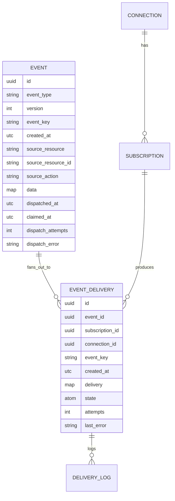

# Outbound Architecture (Design Doc)

**Status:** As-built · **Scope:** the outbound integration model — event types,
capture, dispatch, ordering, delivery. Pre-1.0; no backward-compatibility
constraints.

> Internal maintainers' doc. It assumes familiarity with Ash/Spark (resources,
> actions, DSL extensions/transformers/verifiers) and the Lua transform layer.
> User-facing material lives in [`guides/`](../guides) and the README; this is the
> *why*, those are the *how*.

---

## 1. Summary

The outbound model is **event-first**: the unit on the wire is a named, versioned
**event type** (`product.created`, `stock.changed`), not an internal
resource/action. Source resources declare which of their actions contribute to
which event types; consumers subscribe to event types. This matches how
business-integration consumers think (Stripe, Shopify) and decouples the public
contract from the internal Ash data model.

Six load-bearing concepts:

1. **Event type** — a dotted, versioned name; the wire discriminator and the unit
   of subscription.
2. **Producer** — one module per event type that both *captures* the fact
   (`produce`) and *fans it out* per subscription (`project`); also derives the
   event key. One event type, possibly many source resources, one producer.
3. **Connection** — a direction-neutral link to an external system: partner
   identity + auth + signing secret + transport host, **and** the ordering domain.
   One connection fans out to many subscriptions.
4. **Subscription** — one `(event_type, version)` under a connection, with a Lua
   transform and its own delivery route (HTTP path/method or Kafka topic).
5. **Event key** — a per-event key from the producer that, scoped to a connection,
   drives **both** delivery ordering and latest-state coalescing (the Kafka
   partition-key + log-compaction model). It names *what the payload is a complete
   snapshot of*.
6. **`Event` vs `EventDelivery`** — the immutable fact (captured once, the
   transactional outbox) versus the per-subscription delivery state machine.

## 2. Vocabulary

| Term | Definition |
|------|-----------|
| **Event type** | A dotted, versioned name (`product.created`). The canonical wire discriminator and unit of subscription. Version is a **separate field**, never baked into the string (`product.created` + `version 2`), so `product.*` subscriptions stay stable across versions. The string is author-chosen and stored verbatim — by convention verbs are past-tense and decoupled from Ash action names (the type names a business fact, not a `create`/`destroy`), but the framework applies **no** automatic verb mapping; `source_action` keeps the raw Ash action name for audit only. |
| **Producer** | One module per event type implementing the `AshIntegration.Outbound.Declare.Producer` behaviour. Version is data, not structure — it flows through the callbacks as an argument. |
| **Connection** | Partner identity + auth + signing secret + transport host + suspension state + the ordering domain. Direction-neutral and reusable across subscriptions. |
| **Subscription** | `(event_type, version)` + transform + route under a connection. Single-schema transform — exactly one input shape, so preview/testing have no branching. |
| **Event** | The immutable, point-in-time fact. Created once, in the source transaction. The **transactional outbox**: a relay fans it out. |
| **EventDelivery** | The per-subscription delivery: the materialized wire descriptor + delivery state (`pending`/`parked`/`scheduled`/`delivered`/`cancelled`). |
| **Event key** | The producer's `event_key/2` output. Drives `(connection, event_key)` ordering and `(subscription, event_key)` coalescing. *Invariant:* names what the payload is a complete snapshot of. |
| **Subject** | The triggering record's id (`source_resource_id`). **Pure provenance** — stored for audit, never on the wire, no ordering/coalescing role. |

## 3. Declaring events

Event types are declared **at the resource level** and unified by string: an event
type is the **union of every resource-level declaration that names it** (same
string = same logical event). There is no central catalog module — the catalog is
a *derived* view (a boot-time registry scan), not a declared artifact. This keeps
declarations domain-agnostic and is also a necessity: Spark transformers are
module-local, so the change-capture hook *must* be injected on the resource it
observes.

```elixir
defmodule MyApp.Catalog.Product do
  use Ash.Resource, extensions: [AshIntegration.Outbound.Declare.Source]

  outbound_events do
    source_resource "product"   # optional; defaults to the resource's short_name

    event "product.created" do
      actions [:create]
      producer MyApp.Outbound.ProductCreated
      version 1
    end

    event "stock.changed" do
      actions [:update, :destroy]
      producer MyApp.Outbound.ProductStock
      version 1
      version 2
    end
  end
end
```

The same `stock.changed` can be declared on a *different* resource in a *different*
domain with its own producer; consumers subscribe once and get a uniform payload.

**The derived registry.** At boot we scan the host's configured `source_domains`
(`Ash.Domain.Info.resources/1`, filtered to extension-carrying resources — no
global module scan) and build `(resource, action) → event types` and `event_type →
{versions, producing actions}`. Per-mention validity — the named actions exist and
the event declares at least one `version` — is a compile-time/boot check on the
resource (a module-local Spark verifier). The `version` entity carries only a
number; there is **no** per-version `schema` field and **no** cross-mention schema
agreement check (payload shape is convention, enforced later — §14).

The registry's cross-mention checks (`Registry.verify!/0`) run once at boot: each
event type's resource mentions must name the **same** producer, and that producer
must export **all four** callbacks (`produce/3`, `event_key/2`, `project/3`,
`example/1`) — a missing one compiles but would crash the host's business write at
capture, so it fails the boot loudly instead. Because the DSL is compile-time, the
derived registry is **immutable for the running system**: it is built once at boot
into `:persistent_term` (`Registry.warm/0`) and read from there — `catalog/0`,
`triggers/0`, and `producer_for/1` are cache reads (O(1) for `producer_for`), not
per-call domain scans. Boot also warns loudly if the catalog is empty while the
runtime is enabled.

**Preview/test payloads** come from the producer's `example/1` callback (§4), not a
per-version schema module. Declared per-version **schema validation** is deferred
(§14): `data` is a single JSONB map today, validated by neither capture nor dispatch.

## 4. The Producer behaviour

One module per event type (`use AshIntegration.Outbound.Declare.Producer`). Every callback
sees a single version per invocation, so one module + a version argument subsumes
both "pattern-match per version" and "private per-version helpers" — no per-version
modules.

```elixir
@callback produce(version, changesets_and_records :: [{changeset, record}], context) ::
            %{record_id => data}                 # capture; batched over records
@callback example(version) :: data              # preview/tests; never on the hot path
@callback event_key(version, data) :: String.t() # ordering/coalescing key; pure
@callback project(events, subscriptions, context) ::
            %{event_id => event_decision}        # fan-out; batched
```

- **`produce/3`** runs **once per subscribed version, synchronously, in the source
  transaction**, under producer/system authority (no per-actor read). It receives
  the `{changeset, record}` pairs straight from `after_batch` — so the
  before-image (`changeset.data`), arguments, and a destroy's real final state are
  all reachable — and returns the immutable `data`. Batched over records: a bulk
  action is one call, not N.
- **`event_key/2`** is version-aware (to parse `data`) but **must return a
  value-stable key per entity** — `event_key(1, order_123)` and `event_key(2,
  order_123)` must be equal, so a connection holding both versions keeps them
  co-ordered. The framework enforces only the **type**: a non-empty `String.t()`,
  else it **raises at capture** (no nil/blank fallback). Value-stability is an
  unchecked host responsibility (the framework has no other entity identifier to
  diff against).
- **`project/3`** runs at dispatch — see §6.

### 4.1 The produce / project consistency boundary

`produce` (T0, in the source txn) and `project` (T1, async at dispatch) split the
work, and that split is a deliberate per-producer **consistency contract**: a field
captured in `produce` is point-in-time (T0); a field enriched in `project` reflects
dispatch time (T1). The default — capture the in-memory record — is cheap *and*
correct (no query, working deletes, identity/`event_key` pinned at
T0). Push to `project` only what is inherently dispatch-time (subscriber-dependent
scoping/redaction) or what the host explicitly accepts as T1.

## 5. Capture

`PublishEvent` is an Ash change injected by the `Outbound.Source` extension. In the
source transaction's `after_batch` it:

1. resolves the event types the `(resource, action)` contributes (registry);
2. for each, finds the **subscribed** versions (one cheap query — we never produce
   a version nobody listens to) and runs `produce` **once per version**;
3. bulk-inserts one immutable `Event` per `(change, event_type, subscribed
   version)` — versions are independent facts with their own `event-id`;
4. commits. There is **no nudge** — the relay discovers the new rows on its next
   poll (poll-only discovery is uniform across nodes; see §6).

The `Event` table **is** the transactional outbox: no `Event` without its source
change, and no separate durable dispatch record. Because capture is on the action's
critical path, `produce` running **once instead of once-per-subscription** is a net
reduction in work. (A "lite produce + async enrich" fallback exists per-producer if
a heavy `produce` makes the write too slow; §14.)

**Capture-failure blast radius.** Capture runs in the source transaction, so a
failure (a raising `produce`/`event_key`, a failed bulk insert) **rolls back the
host's business action** — the price of outbox integrity. An event opts out per
declaration with `capture_isolation? true`: a `produce`/`event_key` failure for
that event is caught, logged, and surfaced on `[:ash_integration, :capture,
:isolated_failure]` telemetry, and the event is **dropped** while the business
action commits (availability over outbox completeness; the shared bulk insert
remains all-or-nothing).

## 6. The dispatch relay

Fan-out — turning an `Event` into `EventDelivery` rows — runs on a driver-independent
core: `AshIntegration.Outbound.Dispatch.Dispatcher.claim/1` (the outbox cursor) plus
the Event `:dispatch` bulk action (prepared by `Dispatch.Specs`). Two interchangeable
drivers run the **same** Broadway relay callbacks (`prepare_messages →
handle_message → handle_batch → ack`):

- **`Dispatch.Relay`** (production) — a Broadway pipeline:

  ```
  Producer (claim WHERE dispatched_at IS NULL, FOR UPDATE SKIP LOCKED + lease)
    → Processors (partition_by {event_type, version} — so project batches per group)
        prepare_messages: load subscriptions + run batched project/3
        handle_message:   run the Lua transform → build delivery specs
    → Batcher
        handle_batch: stamp Event.dispatched_at + materialize + coalesce,
                      ALL in one transaction
    → ack: notify the scheduler (the stamp already happened in the txn)
  ```

- **the `drain_dispatch!()` test helper** (tests, and a model for a valid low-volume
  driver, e.g. from a coalesced sweep) — a synchronous in-process drain that drives
  those same relay callbacks until the outbox is empty.

For each `(event_type, version)` batch the core:

1. loads the candidate subscriptions (active subscription on an active connection,
   owner preloaded) and runs **`project/3` once over the batch** (§7);
2. for each `:deliver` decision, **materializes** an `EventDelivery`: it resolves
   and snapshots the transport-shaped wire descriptor (the Lua transform over the
   route defaults — §11) on the row;
3. coalesces superseded pending siblings (§8);
4. stamps `Event.dispatched_at` **atomically with the materialized deliveries** (one
   transaction — either the event is dispatched and its deliveries exist, or
   neither); the driver's ack only notifies the scheduler.

**Ordering correctness is not the relay's job.** The scheduler high-water gate (§8)
owns it, so dispatch may run unordered, parallel, and multi-node — one pipeline per
node, each claiming via `SKIP LOCKED`, no leader election. The `partition_by
{event_type, version}` on processors exists only so `project/3` runs once per group,
not as an ordering mechanism.

**Failure handling.**

- *Business* failures (`project`/transform raise, malformed decision) → the
  delivery is **parked** with `last_error`; the event is considered resolved and
  `dispatched_at` is stamped.
- *Infra* failures (DB unavailable mid-materialize) → the batch transaction rolls
  back, so nothing is stamped and nothing is materialized; the group is left
  unstamped, the lease expires, and it re-emits. Re-materialization is clean (a
  rolled-back batch left no partial rows, and a committed event is never re-claimed —
  `claim/1` filters `dispatched_at IS NULL`). The `EventDelivery (event_id,
  subscription_id)` unique identity is a passive backstop, not a skip-on-conflict
  code path.

**Terminal (poison) events — never auto-resolved.** Every claim bumps
`Event.dispatch_attempts`; once it reaches the dispatch stage's `max_attempts` the
claim query (`dispatch_attempts < max_attempts`) stops picking the row up. It is **left undispatched** (`dispatched_at` NULL), so its
`(connection, event_key)` lane stays blocked by the high-water gate, and a poison
`dispatch_error` + `[:ash_integration, :dispatch, :poison]` telemetry surfaces it
once. We do **not** stamp it dispatched: silently dropping a never-delivered event
and letting a newer same-key event jump ahead would break ordering/at-least-once —
correctness over liveness. Recovery is an explicit operator action — the Event's
`:reset_dispatch` action (clears the bookkeeping so `claim/1` picks the row up
again, after the cause is fixed); a host wanting
auto-resolution adds its own change on the `Event` resource (e.g. stamp
`dispatched_at` when `dispatch_error` is set). Find stuck events with
`dispatched_at IS NULL AND dispatch_attempts >= N`.

**Discovery is poll-only.** The producer claims new rows on its `poll_interval_ms`
timer — there is no capture nudge. An in-process nudge would have helped only
same-node latency (a local `send/2`); cross-node discovery already relied on the
poll, and under load the Broadway demand loop drains continuously regardless. So
the poll interval is the single, honest latency knob: idle end-to-end latency ≈
`poll_interval_ms`, uniform across nodes. (If sub-100ms idle latency ever became a
requirement, the correct mechanism is Postgres `LISTEN/NOTIFY` — cross-node, behind
the relay — not an in-process nudge.)

**Configuration.** The dispatch stage owns and validates its own config slice at
boot via NimbleOptions (`AshIntegration.Outbound.Dispatch.Supervisor`) — unknown
keys / bad types fail the boot loudly. Every knob names an *intent*, never a
Broadway internal, so the implementation stays free to change:

```elixir
config :ash_integration,
  dispatch: [
    concurrency:      System.schedulers_online(),  # parallel fan-out (drives both processor + batcher stages)
    poll_interval_ms: 250,                          # outbox poll cadence ≈ idle latency
    batch_size:       100,                           # events claimed + fanned out per round
    max_attempts:     20                            # claim attempts → terminal/stuck (never reaped)
  ]
```

Deliberately **internal**, not knobs (so the implementation can change without a
config break): the soft claim **lease** (a node-liveness reclaim window — dispatch
work has no configured timeout to derive it from, and the fan-out is idempotent so
a too-short lease only wastes work; fixed at 60s); the Broadway batcher
fill-timeout; and the processor/batcher/partition wiring. There are **no per-stage
start flags** — the single `enabled?` (default `true`) gates the whole runtime.

## 7. Authorization, routing & redaction — the `project` hook

There is **no framework-imposed policy gate**. `project/3` is the single host-owned
hook that decides *and* projects in one batched pass over the `events ×
subscriptions` grid:

```elixir
event_decision ::
    :deliver                                       # all candidates, unchanged  ← PUBLIC
  | {:deliver, projected_event}                    # all candidates, one shared projection
  | {:per_subscription, %{subscription_id => sub_decision}}
  | {:skip, reason}                                # none (audit only)
```

- **Fail-closed:** an `event_id` (or a `subscription_id` in a `:per_subscription`
  map) absent from the result is `{:skip, "unauthorized"}` — silence never means
  deliver.
- **Required**, exactly like `produce` (compile/boot error if absent). There is no
  `public?` flag — public is the one-liner `Map.new(events, &{&1.id, :deliver})`.
  A private event can't broadcast by omission.
- **Batched** over both events and subscriptions, so the host authorizes the whole
  grid from one query (`Ash.can?`, a scope match, a call to their own service) —
  the library doesn't prescribe; it's the host's data.
- Runs **before** the untrusted Lua transform, so redaction stays on the right side
  of the trust boundary. Redaction *is* the `projected_event` (a narrowed `data`
  map); it must not fabricate the event's identity.
- A `project` that **raises** parks the affected deliveries for an operator to fix
  and reprocess.

`{:skip, _}` creates **no** `EventDelivery` — the immutable `Event` is the audit
trail.

## 8. Ordering & coalescing

Both key on the **same value** (the event key) at **different scopes**.

**Ordering — `(connection, event_key)`.** Ordering matters only within a connection;
the event key (fixed by the producer, never the subscription) serializes related
events. Two mechanisms together:

- A **partial unique index** `EventDelivery(connection_id, event_key) WHERE state =
  'scheduled'` — database-enforced **one in-flight per lane**.
- A **high-water gate**: the scheduler won't promote a lane while an *older
  same-`event_key` `Event` is still undispatched* (`dispatched_at` NULL). This is
  what makes unordered/parallel/multi-node dispatch safe — a newer event can
  materialize its delivery first, but it can't be *scheduled* ahead of an older
  one. Lanes are selected by the Event's **`id`** — a database-generated UUIDv7.
  Because capture is synchronous (in the source transaction), the id is itself
  occurrence-ordered, with a built-in same-instant tiebreaker.

The lane spans **all of a connection's subscriptions**: `product.created` then
`product.updated` for one product, on two subscriptions, still deliver in order.
Different keys run in parallel; different connections are independent.

**Coalescing — `(subscription, event_key)`.** By default a subscription delivers
only the latest state per key: materializing a new delivery cancels older *pending*
siblings (by the parent Event's `event_id`). Opt out with `notify_on_every_change: true`.
It only ever cancels `pending` rows, skips a key entirely if any sibling is
`parked`, and is **best-effort under concurrency** (two simultaneous jobs can each
leave a pending row — costs one extra at-least-once delivery, collapsed by the next
change). Coalescing across types/versions is structurally impossible (a
subscription is one `(type, version)`).

**The snapshot invariant** makes one key safe for both: *set the event key to what
the payload is a complete snapshot of.* Key **coarser** than the snapshot (distinct
snapshots sharing a key) → coalescing silently drops siblings (data loss). Key
**finer** → you merely forgo some cross-entity ordering (safe). This is Kafka's
model: one key assigns the partition *and* drives log compaction.

**Recency (LWW).** Consumers do last-write-wins by `event-id` — the UUIDv7 is
occurrence-ordered on its own (generated in the source transaction, with a
built-in same-instant tiebreaker), so comparing it directly suffices. `created_at`
is available in the transform input as a human-readable event timestamp (add it to
the wire in Lua if a consumer wants it — it is not emitted by default, §11), but the
id is the ordering key. LWW *within a key*, not gap detection (UUIDv7 ids aren't
contiguous); no sequence number.

## 9. Delivery state machine

`EventDelivery` moves through five states:

| State | Meaning |
|-------|---------|
| `pending` | Materialized with its cached descriptor, awaiting the scheduler. |
| `parked` | A build failure (`project`/transform raised or returned a bad shape): created with `delivery: nil` + `last_error`, never delivered, but an *older* parked head still blocks its lane. |
| `scheduled` | A delivery job exists. **Only `scheduled` holds the one-in-flight slot** for its lane. |
| `delivered` | Delivered to the target. |
| `cancelled` | Superseded by coalescing, skipped by the transform (`result = nil`), or manually cancelled. Leaves the ordering lane; kept for audit, reaped by cleanup. |

`reprocess` and `park` are **actions**: reprocess re-runs `project` → transform
from the **immutable `Event`** (never re-loading source) and, on success, returns
the delivery to `pending`; otherwise it stays `parked` with the fresh error. This
is how a corrected transform unblocks a lane.

Delivery itself is the **delivery relay** (`Outbound.Delivery.Relay`, a Broadway
pipeline — the delivery-side mirror of the dispatch relay): its producer claims due
`:scheduled` rows (`FOR UPDATE SKIP LOCKED` + a soft `claimed_at` lease, partitioned
by `connection_id`), bumping `attempts` **on the claim** and honoring the durable
`next_attempt_at` backoff. Per row: no-op if not `scheduled` → if the
connection/subscription is now suspended, reset to `pending` → else call the
transport (`deliver_batch/2`, per-row results; `batch_size` 1 until #36), marking
`delivered` (+ reset both failure counters) or recording the error and stamping a
`next_attempt_at` backoff while staying `:scheduled` (lane held). Every
result-writing action is guarded on `state == :scheduled` and fenced on the
`claimed_at` lease token, so a stale claimer can't resurrect a re-claimed row. The
`EventScheduler` (a GenServer; adaptive ~1s busy / 10s idle) still promotes lane
heads. There is **no Oban and no `DeliveryGuardian`**: a lost/crashed claim just
lets the lease expire (derived from the transport timeout, so it always outlives the
slowest send) and another pass re-claims the still-`scheduled` row — idempotent, no
orphan reconciliation. After `delivery: [max_attempts: …]` claims a delivery becomes
**terminal (poison)** — the claim excludes it forever and it is left `scheduled` so
its lane stays blocked (loud telemetry, never auto-resolved). This is the
delivery-side mirror of the dispatch poison policy (§6/#60); the attempt-on-claim
ceiling is what bounds a crash-looping row.

## 10. Suspension & failure isolation

Failures sort by *where the problem is*. **Connection** and **Subscription** both
carry `active` (manual), `suspended` (auto), and `consecutive_failures`:

| Failure | Class | Bumps | Effect |
|---------|-------|-------|--------|
| Can't reach target (conn refused, DNS/TLS, timeout, broker down) | transport | **Connection** | auto-suspend → pauses all its subscriptions |
| Target rejected (HTTP 4xx/5xx, …) | response | **that Subscription** | auto-suspend → other event types keep flowing |
| Transform/`project` raised at dispatch | build | neither | the delivery **parks** — no counter, only reprocess |

A healthy endpoint can reject one event type while accepting others, so counting
all failures at the connection would let one bad type suspend everything
(noisy-neighbor). A **successful delivery resets both** counters; an unclassified
failure defaults to `response` (narrower blast radius). Threshold default 50.
Kafka rarely trips the subscription counter (the broker accepts bytes without
semantic validation).

Two details keep the counter honest:

- **No double-penalty on the terminal attempt.** The attempt that tips a delivery
  into poison (`attempts >= delivery max_attempts`) does **not** bump the
  suspension counter — that row is already stuck `:scheduled` blocking its own lane
  forever (§9), so also suspending the whole connection/subscription on top would
  punish twice. The audit log row is still written.
- **Atomic auto-suspend.** Crossing the threshold suspends via a **filtered
  update** (`suspended == false`), so two concurrent threshold-crossers don't both
  log/telemetry a suspension — exactly one update matches; the loser is a clean
  no-op.

A blank signing-secret never fails silently: if a connection has a *present-but-empty*
`signing_secret`, the delivery is sent unsigned but emits a warning +
`[:ash_integration, :signing, :blank_secret]` telemetry (§11) rather than silently
shipping without a signature.

A suspended subscription holding a lane's oldest event **parks that key's lane**
until it recovers — the §8 head-of-line tradeoff extended to suspension:
correctness over liveness, scoped to the one key.

## 11. The wire contract

The wire **leads with the event type**; provenance (`source_resource` /
`_id` / `_action`) is internal-only and never emitted.

| Concern | Kafka header | HTTP header | Source |
|---------|--------------|-------------|--------|
| Event identity | `event-id` | `x-event-id` | the `Event` UUIDv7 (stable across subscriptions) |
| Event type | `event-type` | `x-event-type` | `product.created` |
| Version | `event-version` | `x-event-version` | `1` |
| Signature (if secret set) | `signature` | `x-signature` | HMAC over `"<timestamp>.<body>"` (Stripe-style), recomputed + injected live per attempt |

`Envelope.wire_pairs/1` emits a **deliberately minimal** default set — only the
three fields every consumer needs: `event-id` (dedup), `event-type` (the
routing/contract discriminator), `event-version` (which schema to parse). They
pre-seed the transform's `result.headers`, so a transform may add, override, or
remove any of them. The **signature** is the one header never snapshotted — it is
injected live at delivery (below), not by `wire_pairs/1`.

Three values are **available in the transform input but not emitted by default** —
add them in Lua only if a specific consumer needs them:

- `created_at` — redundant on Kafka (the native record timestamp), informational on
  HTTP; carried as `event.created_at`.
- `event_key` — an internal ordering/coalescing key. On Kafka it is already the
  native partition key (the message key, set independently of headers); on HTTP it
  carries no ordering meaning and dedup should key on `event-id`. Carried as
  `event.event_key`. The library selects the Kafka partition with the **standard
  murmur2 partitioner** (`toPositive(murmur2(key)) rem partitions`), matching the
  Java client and librdkafka — so a non-AshIntegration producer writing the same
  key lands on the same partition (interop), not `:erlang.phash2`. If the partition
  count can't be read, the send returns a **retryable** transport error rather than
  defaulting to partition 0 (which would silently break per-key ordering).
- connection id — an internal UUID the consumer can't act on: a leak, not a
  contract. Not exposed to the transform at all.

Bare names on Kafka, `x-` prefix on HTTP, identical suffixes. The **body** is the
per-subscription transform output.

**Transform-shaped output + live signing.** The Lua transform reads a read-only
`event` table and mutates a **pre-seeded, transport-shaped `result`** descriptor
(HTTP: `method`/`path`/`url`/`headers`/`body`; Kafka: `topic`/`key`/`headers`/
`value`/`timestamp`). A no-op script ships the route defaults; `result = nil` skips
(→ `cancelled`). The resolved descriptor (body as a term, headers, routing) is
snapshotted on the `EventDelivery` and replayed on every retry. Two secret-derived
headers are **never** snapshotted and are injected **live at delivery**: auth
(resolved from the encrypted connection) and the **signature** (recomputed per
attempt over the exact bytes sent, with a send-time timestamp) — so a rotated secret
applies immediately and the anti-replay timestamp stays honest on retries.
Reprocess is only needed for an edited transform or route config, not a secret
rotation.

**Untrusted-output guards (operator-trust boundary).** The transform is
operator-authored but untrusted at runtime, so its output is validated before it
can reach the wire — each of these **parks** the delivery with a readable error
rather than crashing a lane:

- **SSRF egress** — the resolved HTTP URL (both the `base_url`-joined path and a
  transform-set `result.url`) is host-resolved and rejected when any address is
  private/loopback/link-local/metadata. On by default; opt out per-deployment or
  allowlist specific hosts (`config :ash_integration, egress: …`). Re-checked live
  at send time against DNS rebinding.
- **Header control chars** — a `\r`/`\n`/C0/DEL in a transform-built header name
  or value is rejected at the resolver boundary (request-splitting + lane
  wedging).
- **Sandbox resource limits** — the Lua run is bounded by a luerl
  `max_reductions` budget, a per-runner `:max_heap_size`, and a wall-clock
  `max_time`, and runs under `Task.Supervisor.async_nolink` so a crash/kill is
  isolated from the caller (`config :ash_integration, lua_sandbox: …`).

**Secret hygiene in audit rows.** The delivery log redacts secret-bearing header
values (`authorization`, `x-signature`, …) from the snapshotted descriptor copy,
truncates + masks reflected secrets in the stored `response_body`, and scrubs
error reasons (whitelisting atoms/printable strings; structs collapse to their
module name) so a decrypted credential can't land in `last_error`. The live
descriptor on `EventDelivery` keeps a transform-set `authorization` verbatim (it
is the live auth override) — only the queryable log copy is redacted.

## 12. Data model

Five host-owned resources, each a library Spark extension that injects its schema
(the host names the module/table and wires them by config):



- **`EVENT`** is immutable except for the relay bookkeeping block (`dispatched_at`,
  `claimed_at`, `dispatch_attempts`, `dispatch_error`) — not part of the fact. It
  is the outbox; the only mutation is `mark_dispatched`. `NULL dispatched_at` = in
  the outbox. Indexed for the claim (`(id) WHERE dispatched_at IS NULL`) and the
  gate (`(event_key, id) WHERE dispatched_at IS NULL`).
- **`EVENT_DELIVERY`** is the delivery state machine. Unique
  `(event_id, subscription_id)` gives idempotent re-dispatch; the ordering index is
  `(connection_id, event_key) WHERE state = 'scheduled'`. `delivery` is the
  materialized wire descriptor.
- **`CONNECTION`** is direction-neutral (the `Outbound`/`Inbound` namespace split
  reserves the symmetric inbound set; inbound would reuse the same connection).
- **`SUBSCRIPTION`** carries the transform, the route (`route_config`:
  HTTP path/method or Kafka topic), `notify_on_every_change`, and its health fields.
- The event-type **catalog/schema is not persisted** — derived from the DSL at boot.

## 13. Guarantees

| Guarantee | Scope |
|-----------|-------|
| Delivery | At-least-once; dedupe by `event-id`. |
| Ordering | In-order per `(connection, event_key)`; parallel across keys; none across connections. |
| Recency (LWW) | Compare `event-id` (occurrence-ordered UUIDv7); within a key; no sequence field. |
| Coalescing | Latest-state per `(subscription, event_key)`; opt out via `notify_on_every_change`; safe under the snapshot invariant. |
| Suspension | Transport failures suspend the connection; response rejections suspend the subscription; success resets both. |
| Schema stability | One schema per `(event_type, version)` — convention now, enforced later. |
| Stuck events | A poison event stays undispatched and blocks its lane; a poison delivery (once `attempts` reaches `delivery: [max_attempts: …]`) stays `scheduled` and blocks its lane. Never auto-resolved. |

## 14. Alternatives & deferred work

**Alternatives considered and rejected:**

| Alternative | Why rejected |
|-------------|--------------|
| Resource/action-first wire model | Leaks Ash idioms (`destroy`), can't express non-CRUD/cross-resource events. |
| Central event-catalog module | Spark can't inject capture across modules; the string-union model is domain-agnostic. |
| Many `(type, version)` per subscription, branch in Lua | Dumps schema-union complexity into the least-testable layer; breaks single-schema preview. Solved by connection fan-out. |
| Transform-at-delivery (one canonical event, no per-subscription copy) | Loses snapshot-at-dispatch and per-subscription retry/coalescing. We keep a materialized descriptor per `EventDelivery`. |
| Framework-imposed Ash read-policy gate | Forces policy on public types; `project` subsumes it (call `Ash.can?` inside if you want readable==deliverable). |
| One module *per version* for a producer | Every callback already sees one version; per-version modules only make it implicit while forcing shared code public. |
| Auto-reaping poison events | Silently drops a never-delivered event and reorders its lane — a correctness violation. We leave them stuck (§6). |
| Per-event Oban dispatch job | A second durable record pointing at the `Event` is redundant — the `Event` table is the outbox; the relay claims it directly. |

**Deferred:**

- **Strict schema enforcement** — a declared per-version `schema` to validate
  `produce` output against and reject drift. Neither the `schema` field nor the
  validation exists yet; `version` carries only a number today.
- **Structured (embedded) payloads** — `data` is a single JSONB map today; embedded
  per-version schemas would let Ash field policies share redaction with `project`.
- **CloudEvents output modes** (binary + structured) as a selectable default.
- **Incremental/delta events** — reachable in `produce` today (the before-image is
  in the changeset), but not a first-class feature; no before-image is persisted.
- **Digest/aggregate events** that debounce many changes into one (needs an
  event-scoped producer + debounce window + subject-less event).
- **Split coalescing key** — an optional `coalescing_key/2` for the rare case
  needing ordering coarser than coalescing.
- **`project` strategy helpers** (an `Ash.can?`-as-owner default, scope-match) —
  deferred until usage patterns emerge.
- **Inbound integrations** — the symmetric set under `AshIntegration.Inbound.*`,
  reusing the shared `Connection`.
- **Per-producer "lite produce + async enrich" fallback** — keeps the write fast at
  the cost of T1 (dispatch-time) consistency for enriched fields.
