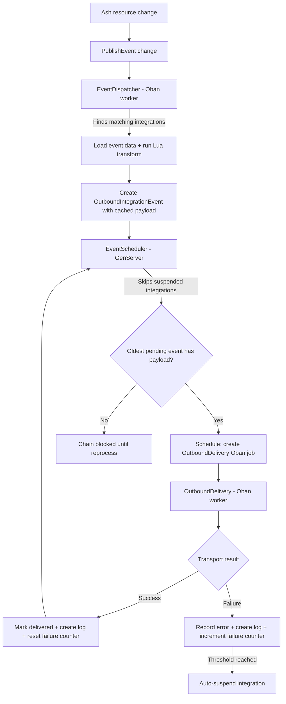

# Delivery Pipeline Architecture

This guide explains how AshIntegration's event-driven delivery pipeline works:
how source changes become outbound deliveries, how ordering and reliability are
guaranteed, and how the system handles failures.

## Overview

When an Ash resource changes, the pipeline:

1. Creates an `OutboundIntegrationEvent` for each matching integration
2. Caches the Lua-transformed payload on the event at creation time
3. Schedules delivery jobs one at a time per `(integration, resource_id)` chain
4. Delivers via the configured transport (HTTP, Kafka, gRPC)
5. Creates an `OutboundIntegrationLog` entry for each delivery attempt

**Delivery semantics**: This is an **at-least-once** delivery system. If a node
crashes after the target system accepts a request but before the event is marked
as delivered, the event will be re-delivered. Consumers should deduplicate by
event ID (the UUIDv7 primary key, included in every payload).

## Pipeline Flow



## Event State Machine

Events move through four states:

```
  pending ──► scheduled ──► delivered
     │            │
     └────────────┴──► cancelled
```

| State       | Meaning |
|-------------|---------|
| `pending`   | Created with cached payload, waiting for scheduler. If Lua failed, `payload` is nil and `last_error` is set — stuck until `:reprocess`. |
| `scheduled` | An Oban delivery job exists for this event. |
| `delivered` | Successfully delivered to the target system. |
| `cancelled` | Manually cancelled, will not be delivered. |

## Key Components

### EventDispatcher (Oban worker)

**Queue**: `integration_dispatch`

Triggered by the `PublishEvent` Ash change when a source resource changes.
For each matching integration (including suspended ones — events are always
created to prevent data loss):

1. Loads event data via `EventDataLoader`
2. Runs the Lua transform script inline
3. Creates an `OutboundIntegrationEvent` with the cached payload
4. If Lua fails, creates the event with `payload: nil` and `last_error` set
5. If Lua returns `skip`, creates a `cancelled` event for the audit trail
6. Notifies `EventScheduler` that new events are ready

### EventScheduler (GenServer)

**Not** an Oban worker — runs under `AshIntegration.Supervisor` with adaptive
scheduling:

- **Busy**: ~1 second cycle (triggered by dispatchers via `notify/0`)
- **Idle**: 10 second sweep (background timer)
- **Debounced**: multiple dispatchers creating events simultaneously only
  trigger one run

On each cycle:

1. Finds `(integration_id, resource_id)` pairs with pending events, no
   scheduled events, and non-suspended integrations
2. For each pair, selects the **oldest** pending event
3. If it has a payload, calls `:schedule` (creates delivery job atomically)
4. If it has no payload, the chain is blocked — logs a warning
5. Processes up to 100 pairs per cycle; loops immediately if the batch was full

**Ordering invariant**: The scheduler always picks the oldest pending event.
If that event has no payload (Lua failed), the entire chain is blocked. Younger
events are never scheduled ahead of older ones.

### OutboundDelivery (Oban worker)

**Queue**: `integration_delivery`, max 20 attempts

Delivers a single event:

1. Loads the event, checks it's still in `scheduled` state
2. Loads the integration, calls `transport.deliver/4`
3. **On success**: marks event as `delivered`, creates a success log,
   resets `consecutive_failures` on the integration — all in one transaction
4. **On failure**: records the error, creates a failure log, increments
   `consecutive_failures` — triggers auto-suspension if threshold reached

Uses Oban's default exponential backoff (no custom backoff needed since
attempts map 1:1 with actual delivery attempts).

### DeliveryGuardian (GenServer)

Runs every 30 seconds under `AshIntegration.Supervisor`. Ensures events and
delivery jobs are never permanently lost:

1. **Rescues discarded jobs** — resets discarded delivery jobs to `available`
   with restored retry headroom
2. **Restores headroom** — bumps `max_attempts` on jobs approaching exhaustion
3. **Reconciles orphaned events** — finds events in `scheduled` state with no
   corresponding Oban job (and not for suspended integrations), moves them back
   to `pending` so EventScheduler can re-create the delivery job. Uses a
   10-minute safety threshold to avoid racing with legitimately-executing jobs.

## Ordering Guarantee

Ordering is per `(integration, resource_id)`:

1. Events get UUIDv7 IDs (time-ordered)
2. A **partial unique index** on `(integration_id, resource_id) WHERE state = 'scheduled'`
   enforces at the database level that only one event per resource can be
   in-flight at a time
3. EventScheduler always selects the **oldest** pending event — if it has no
   payload, the chain is blocked
4. After delivery, the scheduler picks up the next pending event

The partial unique index is database-enforced and cannot be violated by
application bugs. If two schedulers race (multi-node), one gets a constraint
violation and safely skips.

Events for **different resource_ids** within the same integration run in
parallel. Only same-resource events are serialized.

## Integration Suspension

When a target system is persistently failing, the pipeline stops delivery
attempts but **never stops creating events**.

- **Deactivate** = EventDispatcher stops creating events. Data is lost during
  the outage.
- **Suspend** = Events keep being created normally. EventScheduler skips
  suspended integrations. When unsuspended, the backlog drains in order.
  **No data lost.**

### Auto-suspension

Consecutive failure tracking happens inside Ash `after_action` hooks, within
the same database transaction:

- `:deliver` resets `consecutive_failures` to 0
- `:record_attempt_error` atomically increments `consecutive_failures`
- When the counter reaches the threshold (default: 50), the integration is
  automatically suspended

The counter resets on any successful delivery because that proves the
integration (target system, auth, transport) is healthy. Per-resource failures
are visible via `last_error` on individual events.

## Transaction Boundaries

Each state transition and its side effects happen within a single database
transaction via Ash `after_action` hooks:

| Step | Atomic scope |
|------|-------------|
| Dispatch | Event creation (Lua runs before, payload cached) |
| Schedule | Event state -> `scheduled` + Oban job insert |
| Deliver (success) | Event state -> `delivered` + log + reset `consecutive_failures` |
| Record attempt error | Event update + log + increment `consecutive_failures` (+ auto-suspend) |
| Cancel | Event state -> `cancelled` (Oban cancel is best-effort) |
| Reprocess | Lua runs inline, payload + state updated |

Only `scheduled` events have a corresponding Oban delivery job. `pending`
events exist without jobs — the EventScheduler picks them up.

## Cleanup

`OutboundIntegrationLogCleanup` (Oban cron job, default: daily at 3 AM)
removes old logs and delivered/cancelled events older than the retention
period (default: 90 days). Uses `Ash.bulk_destroy!/4` with
`:atomic_batches` strategy.

## Edge Cases

- **Oban job lost**: Event stays `scheduled`. After 10 minutes,
  DeliveryGuardian detects the orphan and moves it back to `pending`.
  EventScheduler re-creates the job. Possible duplicate delivery.

- **Lua script updated**: Use "Reprocess" on individual events or
  "Reprocess All Failed" on the integration. Lua runs with the current
  script, payload is updated, event returns to `pending`.

- **Event cancelled while scheduled**: Cancel sets state to `cancelled`
  and best-effort cancels the Oban job. The delivery worker checks state
  at the start of `perform` and no-ops.

- **Target system down for extended period**: Events keep being created
  (no data loss). Auto-suspension stops delivery churn. When unsuspended,
  the backlog drains in order. No thundering herd — the partial unique
  index ensures at most one in-flight event per resource chain.
