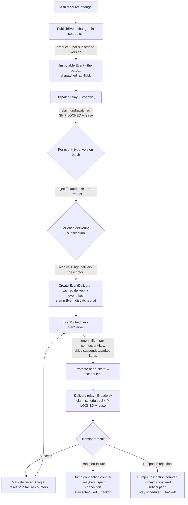

# Delivery Pipeline Architecture

This guide explains how AshIntegration's event-driven delivery pipeline works:
how source changes become outbound deliveries, how ordering and reliability are
guaranteed, and how the system handles failures.

## Vocabulary

The pipeline is **event-first**: the thing on the wire is a named, versioned
**event type**, not an internal resource/action.

| Term | Meaning |
|------|---------|
| **Event type** | A dotted, versioned name (`product.created`, `stock.changed`). The contract on the wire and the unit of subscription. |
| **Connection** | A configured link to an external system: transport type + host (HTTP base URL / Kafka brokers) + auth + signing secret + connection-wide defaults, **and** the ordering domain. One connection fans out to many subscriptions. |
| **Subscription** | One `(event_type, version)` under a connection, with a single Lua transform **and its own delivery route** (HTTP path + method, or Kafka topic). So one connection (one credential, one ordering domain) can route different event types to different paths/topics. |
| **Producer** | One module per event type. It *captures* the immutable event payload (`produce`), derives the **event key** (`event_key`), and decides who receives the event and what it looks like for them (`project`). |
| **Event** | The immutable, point-in-time fact, captured once in the source transaction. The transactional outbox the dispatch relay fans out. |
| **EventDelivery** | The per-subscription delivery: a materialized wire descriptor plus its delivery state. One `Event` fans out to many `EventDelivery` rows. |
| **Event key** | A per-event key (from the producer) that, scoped to a connection, drives **both** delivery ordering and latest-state coalescing. |
| **Subject** | The triggering record an event is about (its source resource id). Stored for audit only — it has no ordering or coalescing role. |

## Overview

When an Ash resource changes, the pipeline:

1. **Captures**, in the source transaction, an immutable **`Event`** for each
   event type the changed `(resource, action)` contributes to — the producer's
   `produce/3` builds its point-in-time payload (once per subscribed version)
2. A **dispatch relay** claims undispatched events and, per `(event_type,
   version)`, runs the producer's `project/3` to decide who receives each event
   and what it looks like for them
3. Per delivering subscription: resolves the transport-shaped delivery descriptor
   (the Lua transform over the route's pre-seeded defaults) and materializes an
   **`EventDelivery`** with it cached
4. Schedules delivery one at a time per `(connection, event_key)` lane
5. Delivers via the connection's configured transport ([HTTP](http-transport.md)
   or [Kafka](kafka-transport.md))
6. Writes a delivery-log entry for each attempt

A single source change can fan out to **several event types and several
subscriptions** — each event type is captured as its own immutable `Event`, and
each delivering subscription gets its own materialized `EventDelivery`.

**Delivery semantics**: This is an **at-least-once** delivery system. If a node
crashes after the target system accepts a request but before the event is marked
as delivered, the event will be re-delivered. Consumers should deduplicate by
event id (the UUIDv7 sent as `event-id`, also present in the transform input).

**Latest-state by default**: By default a subscription delivers only the
**latest state per event key** — when a new event is dispatched, older *pending*
events with the same `(subscription, event_key)` are superseded (cancelled).
This suits state-sync consumers and keeps backlogs small. Set
`notify_on_every_change: true` on the subscription to send **one delivery per
change** (see [Latest-State Delivery](#latest-state-delivery-coalescing)).

## Pipeline Flow



## Delivery State Machine

Each `EventDelivery` moves through five states (the immutable `Event` upstream is
not a state machine — it is captured once and fanned out):

```
  pending ──► scheduled ──► delivered
     ▲ │           │
     │ └───────────┴──► cancelled
     │
  parked  (build failure — reprocess returns it to pending)
```

| State       | Meaning |
|-------------|---------|
| `pending`   | Created with its cached descriptor, waiting for the scheduler. |
| `parked`    | A **build failure**: `project` or the transform raised (or returned a bad shape), so the delivery was still created with `delivery: nil` and `last_error`. The scheduler never delivers it, but an *older* parked delivery still blocks its `(connection, event_key)` lane until an operator reprocesses it. |
| `scheduled` | A delivery job exists. **Only `scheduled` deliveries hold the one-in-flight slot** for their `(connection, event_key)`. |
| `delivered` | Successfully delivered to the target (bytes went out). |
| `suppressed` | Withheld by content suppression: the body was identical to the last delivered body for the key, so nothing was sent. Terminal, leaves the lane like `delivered`, but a distinct bucket so it never reads as a real send. See [Content Suppression](#content-suppression-suppress_unchanged). |
| `cancelled` | Superseded by coalescing, skipped by the transform, or manually cancelled. Leaves the ordering lane (kept for audit, reaped by cleanup). |

`reprocess` and `park` are **actions**, not states: reprocessing re-runs
`project` and the transform for a parked delivery from the **immutable `Event`**
and, on success, returns it to `pending`; if it still fails it stays `parked`
carrying the fresh `last_error`. This is how a corrected transform unblocks a
stuck lane.

## Key Components

### Capture and the dispatch relay

**Capture** (`PublishEvent`, in the source transaction). When a source resource
changes, the injected change resolves every event type the `(resource, action)`
contributes and, for each **subscribed** version, runs the producer's `produce/3`
to capture an **immutable `Event`** — the point-in-time fact, the transactional
outbox. There is **no per-event Oban job**; the Event table *is* the queue. Capture
just commits — the relay discovers the new rows on its next poll (no nudge).

**Dispatch relay** (`AshIntegration.Outbound.Dispatch.Relay`, Broadway — **not** an
Oban queue). It claims undispatched `Event`s (`dispatched_at IS NULL`) with
`FOR UPDATE SKIP LOCKED` + a soft lease — safe to run unordered/parallel/multi-node
because the scheduler high-water gate (below) owns ordering, not claim order. For
each `(event_type, version)` **batch** it:

1. Runs the producer's **`project/3`** once over the batch — the single host-owned
   hook that decides *who* receives the event and *what it looks like* for them
   (authorize + route + redact). A `{:skip, _}` decision creates **no**
   `EventDelivery`; the immutable Event remains as the audit.
2. For each delivering subscription, resolves the transport-shaped delivery
   descriptor (the Lua `transform(event, defaults)` returns the route's pre-seeded `defaults`) and
   snapshots it on the `EventDelivery` — body (as a term), headers, and routing.
   It is replayed on every retry; reprocess re-derives it. The **signature** and
   **auth** are *not* part of the snapshot: both are injected live at delivery
   (the signature is signed fresh per attempt, so a rotated secret applies without
   reprocess).
3. Creates the `EventDelivery` (state `pending`), then coalesces superseded
   pending siblings.
4. **Acks** by stamping `Event.dispatched_at` and notifying the scheduler.

Outcomes:

- **`project` raises / returns a bad decision**, or the **transform raises** → the
  delivery is created `parked` with `last_error` (a build failure); it blocks its
  lane until reprocessed. The event is still considered dispatched. Emits
  `[:ash_integration, :delivery, :parked]` (`failure_kind` `:project`/`:transform`).
- **Transform skips** (`transform` returns `nil`) → a `cancelled` delivery for the audit trail.
- **Infra failure mid-materialize** (DB unavailable) → `dispatched_at` is left
  NULL; the lease expires and the relay re-emits the event. Re-materialization is
  idempotent via the `(event_id, subscription_id)` unique identity.
- **Terminal (`:expired`) events**: there is **no attempt ceiling**. Every claim
  bumps `Event.dispatch_attempts`, but that is an honest counter, never a verdict —
  a failed dispatch (almost always transient infra) is just re-emitted on the next
  lease, one row per lane, so a degraded DB can never poison the backlog. An event
  becomes terminal only via the **opt-in age sweep**: set `dispatch:
  [max_dispatch_age_ms: …]` and an undispatched Event older than that is taken
  terminal (`dispatch_terminal_reason: :expired`, logged + `[:ash_integration,
  :dispatch, :expired]` telemetry). A terminal event is **left undispatched** and
  **never** auto-resolved, so its lane stays blocked until you fix the cause and
  `:reset_dispatch` it (or `Dispatcher.reset_terminal/0` to clear them all at once).
  This is deliberate: silently stamping a never-delivered event and letting a newer
  same-key event jump ahead would break ordering. Find stuck events with
  `dispatched_at IS NULL AND dispatch_terminal_reason IS NOT NULL`. See
  `design/dispatch-terminal-model.md`.

Deliveries are created **even for suspended** subscriptions/connections, so
suspension never loses data. Only `active = false` (deactivation) stops delivery
creation. At low volume you can skip the relay — set `enabled?: false` and call
`AshIntegration.Outbound.Dispatch.Dispatcher.dispatch_pending!/0` (e.g. from an
Oban sweep); the fan-out core and the gate are identical either way.

### EventScheduler (GenServer)

**Not** an Oban worker — runs under `AshIntegration.Supervisor` with adaptive
scheduling:

- **Busy**: ~1 second cycle (triggered by dispatchers via `notify/0`)
- **Idle**: 10 second sweep (background timer)
- **Debounced**: simultaneous dispatchers only trigger one run

Each cycle promotes the **head** event of every ready `(connection_id,
event_key)` lane to `scheduled`. A single set-based query selects, for each lane,
the oldest event in the `pending`/`parked` frontier and keeps the lane only if:

- its head is `pending` (an older `parked` head blocks the lane),
- neither its subscription nor its connection is suspended, and
- no `scheduled` event already holds that lane's in-flight slot.

Blocked lanes are simply absent from each pass rather than visited-and-skipped,
so parked/suspended lanes produce no per-sweep churn.

### Delivery relay (Broadway)

`AshIntegration.Outbound.Delivery.Relay` is the delivery-side mirror of the
dispatch relay (config under the `delivery:` key — `concurrency` defaults higher,
25, because delivery is network-I/O-bound). It is the **muscle** to the
scheduler's **brain**: the scheduler chooses lane heads and promotes them to
`scheduled`; the relay claims those rows and sends them.

Its producer claims DUE `:scheduled` rows (`FOR UPDATE SKIP LOCKED` + a soft
`claimed_at` lease, oldest `event_id` first), partitioned by `connection_id`. The
claim **bumps `attempts`** (so a relay that crashes mid-send still increments and
can't loop forever — `attempts` counts claims). It also enforces a **per-connection
in-flight cap** (see below). It needs no backoff gate: the
scheduler only promotes a row once its `next_attempt_at` has elapsed, so a
`:scheduled` row is by construction due. For each claimed row the relay calls the
transport (`Transport.deliver_batch/2` — per-row results; `batch_size` is 1 today,
real transport batching lands with #36); suspension is *not* a gate here — the only
`:scheduled` row a suspended entity ever has is its recovery probe, which must
reach the transport to observe recovery. **On success**: marks `delivered` (slot
freed) and writes a success log — all in one transaction. **On failure** the
relay's single failure outcome (`:record_failure`) moves the row
`:scheduled → :failed` and writes a failure log; for a retryable failure it stamps
`next_attempt_at` (the server's clamped `Retry-After` when it sent one, else
exponential backoff with jitter, base→cap = `backoff_base_ms` → `backoff_max_ms` —
or no cursor at all for a suspended entity's probe, which is probe-paced), and for
a non-retryable response it stamps `terminal_reason: :permanent`. The `:failed` row
keeps its lane (see the invariant below), so the lane stays blocked while it waits
(in-order-per-key). See
[`design/delivery-retry-model.md`](../design/delivery-retry-model.md).

Every result-writing action is guarded on `state == :scheduled` **and** fenced on
the `claimed_at` lease token, so a stale claimer (its lease expired and another
pass re-claimed the row) can never resurrect or double-finalize it. Ordering is a
hard DB invariant: a partial unique index on `(connection_id, event_key) WHERE state
IN ('scheduled','failed')` allows at most one **active head** per lane, so a younger
row can never be promoted ahead of an earlier one that is still in-flight or waiting.

There is **no attempt ceiling**: a retryable failure retries indefinitely, paced by
`next_attempt_at` backoff and bounded operationally by suspension + the recovery
probe. A delivery goes **terminal** only via a `terminal_reason`: `:permanent` (a
non-retryable response — set on the first occurrence, `[:ash_integration, :delivery,
:terminal]` telemetry) or `:expired` (the opt-in `max_delivery_age_ms` age sweep). A
terminal row is left `:failed`, holding its lane; recovery is operator opt-in:
**retry** (`reprocess` — back to `:pending` with the lease/backoff bookkeeping and
the terminal verdict cleared) or **skip** (`cancel` — frees the lane for younger
events). Both are offered on the delivery's dashboard page; the dashboard home also
counts standing terminal rows. Find them with `state = 'failed' AND terminal_reason
IS NOT NULL`.

### Per-connection in-flight cap (fairness)

Backoff and suspension only gate **failures**. A connection whose endpoint is
**slow but not failing** — say steady ~50s responses under the 60s
`http_max_timeout_ms`, so nothing ever errors — trips none of them. With many lanes
it could then lease **all** `concurrency` (default 25) batch processors at once and
starve every other connection for the duration. `partition_by connection_id` does
**not** prevent this: it only groups a connection's messages onto one *processor*;
the batchers pull work by demand, so the slow connection's leased rows still fan out
across all batchers.

`max_in_flight_per_connection` (`K`, default `10`; `nil` disables) closes the gap. It
is enforced at **claim time** in
[`Dispatcher.claim/2`](../lib/ash_integration/outbound/delivery/dispatcher.ex): a
connection already holding `≥ K` live-lease rows (i.e. `:scheduled` rows with an
unexpired `claimed_at`) is skipped this round, so no single connection can lease more
than `K` of the batch processors. Because the cap lives in the DB it composes across
nodes for free, and — unlike a node-local semaphore in `handle_batch` — it never
leaves a row *claimed but unrunnable* waiting out its lease.

Three properties, all in **one atomic SQL statement** (so two claimers can't race
past `K`):

- **No over-admission.** One statement is one snapshot: the per-connection live-lease
  count and the claimable candidates are read at the same instant. Each connection's
  candidates are ranked by `event_id`, and only its lowest `K − in_flight` rows are
  eligible — so every claimer independently targets the *same* deterministic prefix.
  `SKIP LOCKED` plus a re-checked lease-freshness qual then **split** that bounded
  prefix between concurrent claimers instead of doubling it. (The only way real
  in-flight briefly exceeds `K` is a lease-expiry re-claim of an abandoned row — the
  same at-least-once window that already permits a duplicate send.)
- **Fairness — no shadowing.** The cap is applied **before** the global
  `ORDER BY event_id … LIMIT`, so a slow connection's older-but-over-cap rows are
  removed from the candidate set and never consume the round's claim budget. Younger
  connections' rows are claimed in the same round; the slow connection's surplus
  simply waits for its in-flight rows to finish.
- **Cost.** A claim-time cap can leave processors idle: if `K` is small and only one
  connection has work, the relay won't lease more than `K` of its rows even with
  batchers free. Size `K` against `concurrency` — the default `10` keeps ≥ 15 of the
  25 slots available to other connections while letting a lone busy connection use a
  healthy chunk.

A **rejected alternative**: a node-local semaphore in `handle_batch` would still let
the producer *claim* rows past the cap (they'd sit leased-but-blocked, waiting out
their lease before another node could take them) and wouldn't compose across nodes.
Capping at claim time avoids both problems.

### No guardian needed

The old `DeliveryGuardian` existed only to reconcile drift between a `:scheduled`
row and its Oban delivery job. With the relay claiming the row **directly** there is
no second record to drift: a lost or crashed claim simply lets the soft lease expire
(the lease is derived from the transport timeout, so it always outlives the slowest
send), and the next pass re-claims the still-`scheduled` row — idempotent, since
consumers dedup by `event-id`. The attempt-on-claim ceiling bounds a crash-looping
row exactly as before. The guardian (and Oban) were removed.

## Ordering Guarantee

Ordering is per **`(connection, event_key)`** — not per event type or
subscription. Ordering only matters within a single connection, and the event
key (the producer's, fixed by the producing event type) is what serializes
related events:

1. Events get **UUIDv7 ids generated by the database** (`uuidv7()`), and **lane
   ordering is by that `id`**. Because capture is synchronous — it happens inside
   the source transaction — an Event's id is itself occurrence-ordered: it sorts
   by time and carries a built-in tiebreaker, so no separate clock column is
   needed.
2. A **partial unique index** on `(connection_id, event_key) WHERE state =
   'scheduled'` enforces at the database level that only one event per lane can
   be in-flight at a time.
3. The scheduler always selects the **oldest** event in a lane; if its head is
   parked, the lane is blocked.
4. After delivery, the scheduler picks up the next event for that lane.

Because the key comes from the producer and not the subscription, two subscriptions
to the same event type under one connection cannot disagree on it. The serialized
lane therefore spans **all of a connection's subscriptions**: `product.created`
then `product.updated` for the same product, delivered through two different
subscriptions, are still delivered in occurrence order.

Events on **different event keys** run in parallel, and **different connections**
are fully independent.

### Honest tradeoff: head-of-line blocking

This ordering guarantee has a real cost. A stuck event for key `X` (a parked
build failure, or a suspended route holding the oldest event for `X`) **parks
that key's entire lane** — and because the lane spans the whole connection, it
holds back later events for `X` **across all of the connection's
subscriptions**, not just one. This is a wider blast radius than a per-target
chain, and it is accepted deliberately: correctness over liveness, scoped to the
one key. Other keys and other connections keep flowing.

Cross-resource ordering only coheres when producers map to the **same** key
space (e.g. both key on `product_id`). If two producers of one event type
genuinely can't share a key space, their events sit on different keys and there
is simply no cross-source order to give — order is only ever promised *within* a
key.

## Latest-State Delivery (Coalescing)

Most consumers care about the **current state** keyed on something, not every
intermediate change. By default the pipeline therefore **coalesces** pending
events per `(subscription, event_key)`: when the relay materializes a new delivery,
it cancels older `pending` deliveries with the same key in that subscription, keeping
only the newest (by the parent Event's `event_id`). Superseded events become `cancelled`
with `last_error: "Superseded by a newer event (coalesced)"` (kept for audit,
reaped by cleanup).

Each compaction emits a `[:ash_integration, :coalesce, :events_dropped]`
telemetry event and an info log, so dropped events are observable.

Why this matters:

- **Bounded backlog.** Because events coalesce on write — and the dispatcher
  keeps creating events even while a route is suspended — at most ~one pending
  event per key accumulates. Unsuspending drains *one event per distinct key*,
  never a backlog of intermediate updates.
- **Smaller blast radius** and fewer redundant deliveries.

### One key, two scopes — and the snapshot invariant

Ordering and coalescing key on the **same** value (the event key) but at
**different scopes**: ordering spans the connection (`(connection, event_key)`);
coalescing is within a subscription (`(subscription, event_key)`).

Using one key for both is safe **only under the snapshot invariant**:

> **Set the event key to *what the payload is a complete snapshot of*.**

Coalescing means "a later event fully supersedes an earlier one with the same
key" — which is correct exactly when both are complete snapshots of the same
thing, which is precisely what the event key names. This is the model Kafka uses:
the same key both assigns the partition (ordering) and drives log compaction
(coalescing).

**This is the one rule producer authors must hold, because getting it wrong fails
silently:**

- Key **coarser** than the snapshot (many distinct snapshots sharing a key —
  e.g. per-line-item bodies all keyed on `product_id`) and coalescing will wrongly
  drop siblings: **silent data loss**.
- Key **finer** and you merely forgo some cross-entity ordering — safe, just
  weaker.

Hold the invariant and both ordering and coalescing are correct at the same
granularity. (For aggregate bodies, key on what the body snapshots: a body that
represents a product's full stock should key on `product_id`, even when triggered
by one inventory item.)

Coalescing across event types or versions can't happen at all — a subscription is
bound to a single `(event_type, version)`, so it's structurally impossible.

**Preconditions and safeguards:**

- Coalescing only ever cancels `pending` events — never `scheduled` (in-flight)
  or `delivered` ones.
- If any `parked` event exists for the key, coalescing is skipped for that key,
  so a blocked chain can't be stranded by cancelling its deliverable siblings.
- It is best-effort under concurrency (two simultaneous dispatch jobs for one key
  can each leave a pending event); that only costs an extra delivery
  (at-least-once already), and the next change for the key collapses it.

**Opting out — a delivery per change:** set `notify_on_every_change: true` on the
subscription. Nothing is coalesced — every change produces its own delivery, each
capturing the payload snapshotted at dispatch time.

## Content Suppression (`suppress_unchanged`)

Coalescing collapses a *pile-up* of queued changes to the latest. **Content
suppression** is the complementary axis: it withholds a delivery whose **body** is
byte-identical to the **last one actually delivered** for the same
`(subscription, event_key)` — so a change that doesn't change *what this subscriber
sees* sends nothing. Opt in per subscription with `suppress_unchanged: true`
(default off).

```elixir
# Only re-notify when the projected body actually changes.
suppress_unchanged: true
```

This is also how you get **field-level subscription** without any extra DSL: the
body is per-subscription (your `project` redaction + Lua transform produce it), so
if your transform narrows the body to just the fields a consumer cares about, a
change to any *other* field yields an identical body and is suppressed. "Tell me
only when these fields change" *is* "project those fields + suppress unchanged."

**Last delivered, not ever delivered.** The comparison is only ever against the
immediately-previous *delivered* body, so a value that recurs still sends:

```
stock 5 → deliver   (baseline 5)
stock 5 → suppress  (identical to last delivered)
stock 6 → deliver   (baseline 6)
stock 5 → deliver   (differs from 6 — a real change again)
```

**A suppressed delivery is its own terminal state, `:suppressed` — not
`:delivered`.** This keeps `delivered` meaning *"bytes went out"*, so "last
delivered" stays an honest health signal: a quiet, all-suppressing lane shows an
old last-delivered and a fresh last-suppressed, never false-green. A suppression
writes a `:suppressed` delivery-log row, emits
`[:ash_integration, :dedup, :suppressed]` telemetry, and — because it touched no
transport — **does not reset the failure counters** (it's neutral to connection
health). The dashboard surfaces it as a distinct badge, a state filter, and a
"Suppressed (24h)" stat.

**Comparing on something other than the body — `dedup_on`.** By default the
hash is over the body only (HTTP `defaults.body` / Kafka `defaults.value`); headers are
excluded because the default `x-event-id` is unique per event and would defeat
suppression. If meaningful state lives in a header, or you want to *exclude* a noisy
body field, set `dedup_on` on the table the transform returns to the exact identity
to compare on (it is consumed for the hash and stripped from the wire payload):

```lua
-- suppress on stock alone; a changing `updated_at` in the body won't force a send
function transform(event, defaults)
  defaults.dedup_on = { stock = event.data.stock }
  return defaults
end
```

**Composes with both delivery modes.** `suppress_unchanged` is orthogonal to
`notify_on_every_change`: combine them for "every *distinct* state" (no coalescing
of pile-ups, but identical consecutive states still suppressed).

**The boundary — dedup is not delta detection.** Suppression fires on *"the body is
identical to the last delivered body."* It cannot express *"fire when field X
transitions but send the whole record"* — the whole record differs for unrelated
reasons, so it would always send. That's delta detection (needs a persisted
before-image) and is out of scope.

**Edge — no baseline.** A first delivery, or one whose baseline `:delivered` row was
already reaped by retention, has nothing to compare against and simply delivers
(then re-establishes the baseline). At-least-once already permits the occasional
redundant send, so this degrades safely.

## Suspension & Failure Isolation

When delivery fails, the failure is classified by **where the problem is** and
isolated to the smallest correct scope. Both **connections** and **subscriptions**
carry `active`, `suspended`, and `consecutive_failures` — the same machinery fed
by different failure classes:

| Failure | Classified as | Bumps | Effect |
|---------|---------------|-------|--------|
| Can't reach the target (connection refused, DNS/TLS, timeout, broker down) | transport | **Connection** `consecutive_failures` | auto-suspends the connection → pauses **all** its subscriptions |
| Target responded with a rejection (HTTP 4xx/5xx, …) | response | **that Subscription's** `consecutive_failures` | auto-suspends that subscription → other event types to the connection keep flowing |
| Transform raised at dispatch (event never became deliverable) | build | neither | the **event** parks (`parked` + `last_error`) — no counter; reprocess to recover |

The split exists because a healthy endpoint can reject *one* event type while
accepting others — counting all failures at the connection would let one bad
event type suspend the whole connection (noisy-neighbor). A **successful delivery
resets both** counters: it proves the transport is healthy (connection) *and*
that this subscription's content is accepted. When the threshold (default: 50) is
reached, the connection or subscription is automatically suspended. An
unclassified failure defaults to `response` (the narrower blast radius).

> Kafka rarely trips the *subscription* counter — the broker accepts bytes
> without semantic validation, so its failures are almost all transport-level.
> Subscription-level suspension is mostly an HTTP concept.

**Active vs. suspended** (the two manual/automatic controls):

- **Deactivate** (`active = false`) = the dispatcher stops **creating** events.
  Data is lost during the outage. Deactivating a connection stops all its
  subscriptions; deactivating a subscription stops just that route.
- **Suspend** = events keep being created normally; the scheduler skips
  suspended routes and an in-flight delivery to a newly-suspended route is reset
  to `pending`. **No data lost** — the backlog drains (coalesced to latest per
  key) when unsuspended.

**Interaction with ordering (by design):** a suspended subscription holding the
oldest event for a key parks that key's lane at the connection until it recovers
— the ordering guarantee forbids delivering a later event ahead of a stuck
earlier one for the same key. This is the head-of-line tradeoff extended to
suspension.

Crossing the threshold emits `[:ash_integration, :connection, :suspended]` or
`[:ash_integration, :subscription, :suspended]`; the inverse `unsuspend` action
emits `:unsuspended` / `:resumed`. See the
[Observability guide](observability.md).

### Parked Health

Parking (the `build` row above) is **not** a transport/response failure, so it
never touches `consecutive_failures` and never auto-suspends on its own — a
broken transform/producer would otherwise read fully green while parking 100% of
its deliveries. To close that blind spot, parking surfaces as its own standing
health dimension, derived from the `parked_count` / `oldest_parked_at` aggregates
on the subscription and connection:

- `:healthy` — no parked deliveries.
- `:degraded` — some parked backlog, **below** `parked_health_threshold`.
- `:parked` — backlog **at/above** `parked_health_threshold` (chronically parked).

`AshIntegration.Outbound.Delivery.ParkedHealth.status/1` derives this for the
dashboard "Parked" stat and the index/detail badges; the real-time signal is the
`[:ash_integration, :delivery, :parked]` telemetry (one per parked row, carrying
`failure_kind`). This dimension is **display/alerting only** — it never halts
delivery.

**Two distinct thresholds (a common point of confusion).** `parked_health_threshold`
(default `10`) only changes the *badge colour* — it is where the health tier flips
from `:degraded` to `:parked`. It does **not** suspend anything. Auto-suspend is a
separate, opt-in control governed by `parked_suspension` with its own
`count_threshold` (default `50`):

```elixir
config :ash_integration,
  parked_health_threshold: 10,                                   # badge: :degraded → :parked
  parked_suspension: [enabled?: true, count_threshold: 50]       # opt-in auto-suspend (default OFF)
```

So with the defaults a subscription reads a red `:parked` badge at 10 parked
deliveries but is not auto-suspended until 50 (and only if `parked_suspension` is
enabled at all). Set `count_threshold` ≤ `parked_health_threshold` if you want a
chronically-parked badge to also halt the route.

The opt-in parked-suspend is a **distinct** suspension: it sets `suspended` on the
**subscription** (the transform's owner — never the connection), is recoverable via
`reprocess` + `unsuspend` like any other, and **never** bumps `consecutive_failures`,
so it is never conflated with the failure-counter suspend above. It is evaluated
**post-commit** (after the dispatch transaction, and after a reprocess run), so its
counting and the suspend write never run inside the dispatch transaction. Because
suspended routes keep accumulating deliveries, the practical effect is to halt the
subscription's *other* (healthy) lanes too and to raise an explicit, monitorable
halt — it reuses `[:ash_integration, :subscription, :suspended]` tagged
`failure_class: "parked"` (with `parked_count` in measurements). It does not stop
new deliveries from parking; only fixing the build (then `reprocess`) clears the
backlog.

## Recency (Last-Write-Wins)

Because delivery is at-least-once and lanes can be re-scheduled, consumers do
**last-write-wins by `event-id`** — the UUIDv7 `event-id` is occurrence-ordered
on its own (generated in the source transaction, with a built-in same-instant
tiebreaker), so comparing it directly is enough. `created-at` is also on the wire
as a human-readable event timestamp, but the id is the ordering key. This is LWW
**within a key**, not gap detection: UUIDv7 ids aren't
contiguous, so a consumer can't tell it skipped an intermediate — which is fine
for state transfer (latest wins regardless, exactly what coalescing already
discards). There is no sequence number. Comparing ids across *different* keys is
meaningless.

## Transaction Boundaries

Each state transition and its side effects happen within a single database
transaction via Ash `after_action` hooks:

| Step | Atomic scope |
|------|-------------|
| Capture | Immutable `Event` insert(s) in the source transaction (`produce` runs before) |
| Materialize | `EventDelivery` creation (`project` + Lua run before; descriptor cached on the row) |
| Schedule | Delivery state → `scheduled` (clears the lease/backoff so it's claimable); the relay claims it directly — no job to enqueue |
| Deliver (success) | Delivery → `delivered` + success log + reset both `consecutive_failures` (guarded `state == :scheduled` + lease token) |
| Record attempt error | Failure log + classified counter (+ maybe auto-suspend) + stamp `next_attempt_at` backoff; stays `:scheduled` (guarded `state == :scheduled` + lease token) |
| Cancel | Delivery → `cancelled` (multi-state: coalesce/reprocess/operator) |
| Reprocess | `project` + Lua re-run from the immutable `Event`; descriptor re-resolved + re-cached (signature stays live at delivery), state updated |

A `scheduled` delivery is its lane's one in-flight head, claimed (or being retried
under backoff) by the delivery relay. `pending` deliveries wait for the scheduler
to promote them.

## Retention

`AshIntegration.Outbound.Retention` is a GenServer in `AshIntegration.Supervisor`
(no Oban cron/queue to wire) that trims the event-first tables autovacuum-style:
frequent passes, each deleting at most `delete_limit` rows per table (default 500),
oldest first, so a backlog drains over successive passes. Like every stage it owns
and validates its own config slice at boot (NimbleOptions):

```elixir
config :ash_integration,
  retention: [
    interval_ms:   :timer.minutes(1), # delay between passes (default: 1 min)
    delete_limit:  500,               # max rows deleted per table, per pass (default: 500)
    delivery_days: 90,                # keep terminal EventDelivery + Log rows (default: 90)
    event_days:    365                # keep the immutable Event log (default: 365)
  ]
```

It deletes (through each resource's `:destroy`): terminal `delivered`/`cancelled`
deliveries and delivery-log rows older than the delivery window (`delivery_days`),
and immutable `Event`s older than the Event window (`event_days`) that are
dispatched and have no remaining deliveries. The "what's old enough to delete"
policy lives in the sweeper — the resources carry no retention action. The whole
sweeper (like the rest of the runtime) is gated by the single `enabled?` switch;
there's no per-stage start flag.

## Edge Cases

- **Claimer lost/crashed mid-delivery**: the row stays `scheduled` with its
  `claimed_at` lease. Once the lease expires (it's derived from the transport
  timeout, so it always outlives the slowest send) the next relay pass re-claims and
  re-sends it. Possible duplicate delivery (dedupe by `event-id`).
- **Retryable failure**: the row stays `scheduled` with `next_attempt_at` set; the
  relay re-claims it once the backoff elapses.
- **Transform script fixed**: use "Reprocess" on an individual parked delivery, or
  "Reprocess All" for a connection. `project` and the transform re-run from the
  immutable `Event`, the descriptor is updated, and the delivery returns to
  `pending`. `produce` is **not** re-run — the immutable `Event` already holds the
  captured payload.
- **Producer's `event_key/2` returned a blank or non-string key**: capture
  **raises** on the source action (the whole change rolls back) — no `Event` is
  created, so the bad key can never reach a lane. Fix `event_key/2` to return a
  stable, non-empty string.
- **Delivery cancelled while scheduled**: cancel sets state to `cancelled`. A relay
  pass already executing that row can't finalize it — the result-writing actions are
  guarded on `state == :scheduled` (plus the lease token), so the cancel wins and the
  stale write is a clean no-op.
- **Target down for an extended period**: events keep being created (no data
  loss). Auto-suspension stops delivery churn. When unsuspended, the backlog
  drains in order — at most one in-flight event per lane, so no thundering herd.
- **Transform emits a control character in a header**: a `\r`/`\n` (or any C0
  control / DEL) in a transform-built header name or value is rejected at the
  resolver boundary and the delivery **parks** with a readable error — it never
  reaches the transport (where it would otherwise crash-loop the lane). Fix the
  transform and reprocess.

## Transform sandbox limits

Lua transforms are **operator-authored but untrusted at runtime** (a typo, a
pathological loop, or hostile event data flowing into the script). Each run is
bounded so one script can't take down the node:

- **CPU** — a luerl `max_reductions` budget kills a runaway loop.
- **Memory** — a per-runner `:max_heap_size` kills an allocation bomb the instant
  it exceeds the heap ceiling, before it can OOM the node.
- **Wall-clock** — a luerl `max_time` plus an outer `Task` backstop.
- **Crash isolation** — the script runs under `Task.Supervisor.async_nolink`, so
  a sandbox crash/kill surfaces as a parked delivery, never as a crash of the
  delivery worker.

A script that hits any limit fails like any other transform error: the delivery
**parks** with the limit in `last_error`. The limits are configurable (safe
defaults shown):

```elixir
config :ash_integration,
  lua_sandbox: [
    timeout_ms:     5_000,
    max_reductions: 100_000_000,   # ≈ a brief spin before the kill
    max_heap_words: 50_000_000     # heap+stack ceiling per run, in words (~400MB)
  ]
```

## Migration notes

- **The gRPC transport was removed.** Only `:http` and `:kafka` are supported. A
  connection whose persisted `transport_config` still carries a `:grpc` tag is
  **rejected at delivery** with a friendly, non-retryable `:transport` error
  (rather than crashing the delivery worker) — migrate the connection to `:http`
  or `:kafka`, or delete it.
